# Atomic Swap Automation Plan

## Executive Summary

This document outlines the complete implementation plan for achieving fully automated cross-chain atomic swaps between Base and Optimism using the BMN EVM Resolver system. The goal is to enable Alice and Bob to execute swaps without manual intervention at any step.

## Current State (As of November 2024)

### ✅ What's Working
1. **Order Creation**: Alice successfully creates orders with secrets and hashlocks
2. **Order Filling**: Bob picks up orders and fills them on Base (source chain)
3. **Smart Contracts**: SimpleLimitOrderProtocol and EscrowFactory deployed and functional
4. **Core Logic**: All individual components (escrow creation, secret reveal, withdrawal) implemented

### ❌ What's Missing
1. **Automatic Destination Escrow Creation**: Bob doesn't automatically create Optimism escrows after Base fill
2. **Automatic Secret Reveal**: Alice doesn't monitor for destination escrows to reveal secrets
3. **Automatic Withdrawal**: Bob doesn't monitor for revealed secrets to withdraw
4. **Event Monitoring**: No real-time blockchain event detection
5. **State Management**: No persistent tracking of swap progress across chains

## Target Architecture

```mermaid
sequenceDiagram
    participant Alice
    participant Bob
    participant Base
    participant Optimism
    
    Alice->>Base: 1. Create Order with Secret
    Note over Alice: Monitors for escrow creation
    
    Bob->>Base: 2. Fill Order → Creates Source Escrow
    Base-->>Alice: Source Escrow Created Event
    
    Alice->>Base: 3. Send Tokens to Source Escrow (Auto)
    Base-->>Bob: Tokens Deposited Event
    
    Bob->>Optimism: 4. Create Dest Escrow + Deposit (Auto)
    Optimism-->>Alice: Dest Escrow Ready Event
    
    Alice->>Optimism: 5. Reveal Secret (Auto)
    Optimism-->>Bob: Secret Revealed Event
    
    Bob->>Base: 6. Withdraw with Secret (Auto)
    Alice->>Optimism: 7. Withdraw Funds (Auto)
    
    Note over Alice,Bob: Swap Complete!
```



### Critical Flow Correction

The atomic swap requires proper fund locking on BOTH chains:

1. **Bob creates source escrow** (when filling order)
2. **Alice deposits her tokens** into Bob's source escrow
3. **Bob creates destination escrow AND deposits his tokens** 
4. **Only then Alice reveals the secret**

This ensures neither party can walk away with both sides of the trade.

### Trust Model

The corrected flow ensures atomicity:
- **Bob takes initial risk** by creating source escrow first
- **Alice locks funds** only after seeing Bob's escrow
- **Bob locks his funds** on destination only after Alice deposits
- **Alice reveals secret** only after both sides are locked
- **Timelock protection** ensures funds can be recovered if either party abandons

This creates a balanced incentive structure where both parties must complete their steps or lose their deposits.

## Implementation Plan

### Phase 1: Event Monitoring Infrastructure (Priority: HIGH)

#### 1.1 Create EventMonitor Service
```typescript
// src/services/event-monitor.ts
export class EventMonitorService {
  private sourceChainWatcher: ChainWatcher;
  private destChainWatcher: ChainWatcher;
  
  async startMonitoring() {
    // Monitor OrderFilled events on Base
    this.sourceChainWatcher.on('OrderFilled', async (event) => {
      await this.handleOrderFilled(event);
    });
    
    // Monitor EscrowCreated events on both chains
    this.sourceChainWatcher.on('EscrowCreated', async (event) => {
      await this.handleSourceEscrowCreated(event);
    });
    
    this.destChainWatcher.on('EscrowCreated', async (event) => {
      await this.handleDestEscrowCreated(event);
    });
    
    // Monitor SecretRevealed events
    this.destChainWatcher.on('SecretRevealed', async (event) => {
      await this.handleSecretRevealed(event);
    });
  }
}
```

#### 1.2 Update Bob Service
```typescript
// bob-resolver-service.ts modifications
class BobResolverService {
  private eventMonitor: EventMonitorService;
  private escrowTracker: Map<string, EscrowState>;
  
  async start() {
    await this.eventMonitor.startMonitoring();
    
    // Step 1: Fill order and create source escrow
    this.eventMonitor.on('NewOrder', async (event) => {
      const sourceEscrow = await this.fillOrderAndCreateSourceEscrow(event.order);
      this.escrowTracker.set(event.orderHash, {
        sourceEscrow,
        status: 'AWAITING_ALICE_DEPOSIT'
      });
      console.log(`✅ Bob created source escrow ${sourceEscrow}`);
    });
    
    // Step 2: Wait for Alice's deposit, then create destination escrow
    this.eventMonitor.on('TokensDeposited', async (event) => {
      const state = this.escrowTracker.get(event.orderHash);
      if (state && event.escrow === state.sourceEscrow) {
        // Alice has deposited, now Bob creates destination escrow
        const destEscrow = await this.createAndFundDestinationEscrow(event.orderHash);
        state.destEscrow = destEscrow;
        state.status = 'AWAITING_SECRET';
        console.log(`✅ Bob created and funded destination escrow ${destEscrow}`);
      }
    });
    
    // Step 3: Withdraw using revealed secret
    this.eventMonitor.on('SecretRevealed', async (event) => {
      const state = this.escrowTracker.get(event.orderHash);
      if (state && state.sourceEscrow) {
        await this.withdrawFromSourceEscrow(event.secret, state.sourceEscrow);
        console.log(`✅ Bob withdrew from source using secret`);
      }
    });
  }
  
  private async createAndFundDestinationEscrow(orderHash: string): Promise<Address> {
    const escrow = await this.createDestinationEscrow(orderHash);
    // Bob deposits his tokens to destination escrow
    await this.depositToDestinationEscrow(escrow, this.getOrderAmount(orderHash));
    return escrow;
  }
}
```

### Phase 2: Alice Automation (Priority: HIGH)

#### 2.1 Create Alice Monitor Service
```typescript
// alice-service-v3.ts
class AliceServiceV3 {
  private eventMonitor: EventMonitorService;
  private secretManager: SecretManager;
  private swapTracker: SwapStateManager;
  
  async start() {
    await this.eventMonitor.startMonitoring();
    
    // Step 1: Monitor for source escrow creation by Bob
    this.eventMonitor.on('SourceEscrowCreated', async (event) => {
      if (event.orderHash in this.myOrders) {
        // Alice deposits her tokens to Bob's source escrow
        await this.depositToSourceEscrow(event.escrowAddress, event.amount);
        console.log(`✅ Deposited ${event.amount} to source escrow ${event.escrowAddress}`);
      }
    });
    
    // Step 2: Monitor for destination escrow creation
    this.eventMonitor.on('DestEscrowCreated', async (event) => {
      if (event.receiver === this.address) {
        // Wait for Bob's deposit confirmation
        await this.waitForDestinationDeposit(event.escrowAddress);
        // Then reveal secret
        await this.autoRevealSecret(event.escrowAddress, event.hashlock);
      }
    });
    
    // Step 3: Monitor for secret reveal to withdraw
    this.eventMonitor.on('SecretRevealed', async (event) => {
      if (event.revealer === this.address) {
        await this.withdrawFromDestination(event.escrowAddress);
      }
    });
  }
  
  private async depositToSourceEscrow(escrowAddress: Address, amount: bigint) {
    // Approve and transfer tokens to source escrow
    await this.tokenContract.approve(escrowAddress, amount);
    await this.escrowContract.deposit(escrowAddress, amount);
    console.log(`💰 Alice deposited ${amount} to source escrow`);
  }
  
  private async waitForDestinationDeposit(escrowAddress: Address) {
    // Ensure Bob has deposited before revealing secret
    const balance = await this.getEscrowBalance(escrowAddress);
    if (balance === 0n) {
      throw new Error("Destination escrow not funded by Bob");
    }
  }
  
  private async autoRevealSecret(escrowAddress: Address, hashlock: Hex) {
    const secret = await this.secretManager.getSecret(hashlock);
    if (secret) {
      await this.revealSecret(escrowAddress, secret);
      console.log(`✅ Auto-revealed secret for escrow ${escrowAddress}`);
    }
  }
}
```

### Phase 3: State Management (Priority: MEDIUM)

#### 3.1 Swap State Manager
```typescript
// src/state/swap-state-manager.ts
export class SwapStateManager {
  private kv: Deno.Kv;
  
  async trackSwap(orderHash: string, initialState: SwapState) {
    await this.kv.set(['swaps', orderHash], {
      ...initialState,
      status: 'CREATED',
      timestamp: Date.now()
    });
  }
  
  async updateSwapStatus(orderHash: string, status: SwapStatus, data?: any) {
    const swap = await this.kv.get(['swaps', orderHash]);
    await this.kv.set(['swaps', orderHash], {
      ...swap.value,
      status,
      lastUpdate: Date.now(),
      ...data
    });
  }
  
  async getPendingSwaps(): Promise<SwapState[]> {
    // Return swaps that need attention
    const entries = this.kv.list({ prefix: ['swaps'] });
    const pending = [];
    for await (const entry of entries) {
      if (entry.value.status !== 'COMPLETED' && entry.value.status !== 'FAILED') {
        pending.push(entry.value);
      }
    }
    return pending;
  }
}
```

### Phase 4: Error Recovery (Priority: MEDIUM)

#### 4.1 Retry Manager
```typescript
// src/utils/retry-manager.ts
export class RetryManager {
  async executeWithRetry<T>(
    operation: () => Promise<T>,
    options: {
      maxRetries: number;
      backoffMs: number;
      exponential?: boolean;
    }
  ): Promise<T> {
    let lastError: Error;
    
    for (let i = 0; i < options.maxRetries; i++) {
      try {
        return await operation();
      } catch (error) {
        lastError = error;
        const delay = options.exponential 
          ? options.backoffMs * Math.pow(2, i)
          : options.backoffMs;
        await sleep(delay);
      }
    }
    
    throw lastError;
  }
}
```

### Phase 5: Integration and Testing (Priority: HIGH)

#### 5.1 Integration Test Script
```typescript
// scripts/test-full-atomic-swap.ts
async function testFullAtomicSwap() {
  console.log("🧪 Testing Full Automated Atomic Swap");
  
  // Start services
  const alice = new AliceServiceV3();
  const bob = new BobResolverService();
  
  await alice.start();
  await bob.start();
  
  // Create order
  const orderHash = await alice.createOrder({
    srcChainId: 8453,
    dstChainId: 10,
    srcAmount: parseEther("0.01"),
    dstAmount: parseEther("0.01"),
  });
  
  // Wait for automatic completion
  const result = await waitForSwapCompletion(orderHash, {
    timeout: 300000, // 5 minutes
    checkInterval: 5000
  });
  
  assert(result.status === 'COMPLETED');
  console.log("✅ Swap completed automatically!");
}
```

## Configuration Updates

### 1. Environment Variables
```env
# Event Monitoring
EVENT_POLL_INTERVAL=5000
EVENT_CONFIRMATION_BLOCKS=2

# Automation Settings
AUTO_REVEAL_ENABLED=true
AUTO_WITHDRAW_ENABLED=true
AUTO_CREATE_DEST_ESCROW=true

# Timeouts
SWAP_TIMEOUT_SECONDS=300
SECRET_REVEAL_TIMEOUT_SECONDS=120

# Retry Settings
MAX_RETRY_ATTEMPTS=3
RETRY_BACKOFF_MS=5000
```

### 2. Service Configuration
```typescript
// config/automation.ts
export const AUTOMATION_CONFIG = {
  alice: {
    autoRevealSecret: true,
    autoWithdraw: true,
    monitorInterval: 5000,
  },
  bob: {
    autoCreateDestEscrow: true,
    autoWithdrawOnReveal: true,
    maxConcurrentSwaps: 10,
  },
  monitoring: {
    blockConfirmations: 2,
    eventBatchSize: 100,
    reconnectDelay: 5000,
  }
};
```

## Success Criteria

### Functional Requirements
- [ ] Alice creates order with secret → Bob detects and fills automatically
- [ ] Bob creates source escrow when filling order
- [ ] Alice deposits tokens to source escrow automatically
- [ ] Bob creates and funds destination escrow after Alice's deposit
- [ ] Alice reveals secret automatically when destination escrow is funded
- [ ] Bob withdraws from source automatically after secret reveal
- [ ] Alice withdraws from destination automatically
- [ ] Both parties receive their funds without manual intervention

### Non-Functional Requirements
- [ ] Swap completes in < 5 minutes under normal conditions
- [ ] System recovers from temporary failures automatically
- [ ] All state changes are logged and traceable
- [ ] No funds can be locked permanently

## Testing Strategy

### 1. Unit Tests
- Event monitor service
- State management
- Retry logic
- Secret management

### 2. Integration Tests
- Full swap flow
- Error recovery scenarios
- Timeout handling
- Multi-swap concurrency

### 3. End-to-End Tests
- Mainnet fork testing
- Gas optimization
- Performance under load
- Network failure scenarios

## Deployment Plan

### Week 1-2: Core Automation
- [ ] Implement EventMonitorService
- [ ] Update Bob's automatic destination escrow creation
- [ ] Update Alice's automatic secret reveal

### Week 3: State & Recovery
- [ ] Implement SwapStateManager
- [ ] Add retry logic
- [ ] Implement timeout handling

### Week 4: Testing
- [ ] Unit tests
- [ ] Integration tests
- [ ] Mainnet fork testing

### Week 5: Production Readiness
- [ ] Monitoring and alerts
- [ ] Documentation
- [ ] Deployment scripts

### Week 6: Launch
- [ ] Deploy to production
- [ ] Monitor first swaps
- [ ] Performance tuning

## Risk Mitigation

### Technical Risks
1. **Chain Reorgs**: Wait for sufficient confirmations
2. **Gas Spikes**: Implement gas price limits and retry logic
3. **RPC Failures**: Multiple RPC endpoints with fallback
4. **State Corruption**: Regular state backups and validation

### Security Considerations
1. **Secret Exposure**: Never log secrets, use secure storage
2. **Front-running**: Use commit-reveal pattern already implemented
3. **Replay Attacks**: Validate nonces and timestamps
4. **Denial of Service**: Rate limiting and resource management

## Monitoring & Observability

### Key Metrics
- Swap success rate
- Average completion time
- Failed swap recovery rate
- Gas costs per swap
- System uptime

### Alerts
- Swap stuck > 10 minutes
- Multiple consecutive failures
- Low wallet balances
- RPC connection issues

## Next Steps

1. **Immediate** (This Week):
   - Fix Bob's destination escrow creation trigger
   - Implement basic event monitoring
   - Add Alice's auto-reveal logic

2. **Short Term** (Next 2 Weeks):
   - Complete state management
   - Add comprehensive error handling
   - Implement retry logic

3. **Medium Term** (Next Month):
   - Full testing suite
   - Performance optimization
   - Production deployment

## Conclusion

The atomic swap system has all the necessary components built. The remaining work is primarily around automation, coordination, and resilience. By following this plan, we can achieve a fully automated, production-ready atomic swap system within 6 weeks.

The key success factor is proper event monitoring and state management to coordinate the multi-step, cross-chain process reliably. With the proposed architecture, the system will be able to handle multiple concurrent swaps automatically while recovering gracefully from failures.