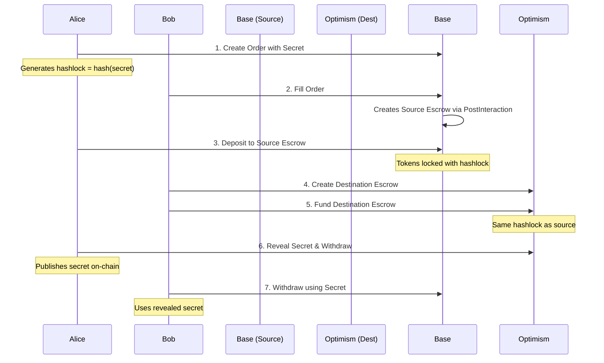

# Complete Atomic Swap Execution Guide

## Overview

This guide explains how to execute a complete atomic swap between Alice and Bob services running in Docker containers. The swap enables trustless cross-chain token exchanges using hash time-locked contracts (HTLCs).

## Prerequisites

1. **Docker Services Running**
   ```bash
   # Start both Alice and Bob services
   docker-compose up -d --build
   
   # Verify services are healthy
   docker-compose ps
   curl http://localhost:8001/health  # Alice
   curl http://localhost:8002/health  # Bob
   ```

2. **Environment Configuration**
   - `.env` file configured with valid private keys
   - `ALICE_PRIVATE_KEY`: Alice's wallet private key
   - `RESOLVER_PRIVATE_KEY` or `BOB_PRIVATE_KEY`: Bob's wallet private key
   - `ANKR_API_KEY`: For RPC access (optional but recommended)

3. **Token Balances**
   - Alice needs BMN tokens on source chain (Base)
   - Bob needs BMN tokens on destination chain (Optimism)
   - Both need ETH for gas fees

## Atomic Swap Flow



## Method 1: Automated via API (Recommended)

### Step 1: Trigger the Swap

```bash
# Execute atomic swap (Base → Optimism, 0.01 BMN)
deno run --allow-all scripts/trigger-atomic-swap.ts 8453 10 0.01

# Or with custom parameters
deno run --allow-all scripts/trigger-atomic-swap.ts [sourceChain] [destChain] [amount]
```

This script will:
- Check service health
- Trigger Alice to create an order
- Monitor the swap progress
- Report status updates in real-time

### Step 2: Monitor Progress

The trigger script automatically monitors, but you can also monitor manually:

```bash
# Monitor using the hashlock from Step 1
deno run --allow-all scripts/monitor-swap.ts 0xHASHLOCK 8453 10
```

### Expected Output

```
🔄 Bridge-Me-Not Atomic Swap Trigger
=====================================

✅ Both services are healthy

📋 Swap Parameters:
   Source Chain: Base
   Destination Chain: Optimism
   Amount: 0.01 BMN

🚀 Triggering Alice to create order...
✅ Order created successfully!
   Hashlock: 0x1234...
   Order Hash: 0x5678...

📊 Monitoring swap with hashlock: 0x1234...

✅ Status: ORDER_CREATED
✅ Status: ORDER_FILLED
   Source Escrow: 0xabcd...
✅ Status: SOURCE_DEPOSITED
✅ Status: DESTINATION_CREATED
   Destination Escrow: 0xef01...
✅ Status: DESTINATION_FUNDED
✅ Status: SECRET_REVEALED
   Secret Revealed: 0x9876...
✅ Status: COMPLETED

🎉 Swap completed successfully!
```

## Method 2: Manual Order Creation

### Step 1: Create Order Manually

```bash
# Create a simple order with extension data
deno run --allow-all scripts/create-simple-order.ts
```

This creates an order file in `pending-orders/` with:
- Hashlock for coordination
- PostInteraction data for escrow creation
- Proper EIP-712 signature

### Step 2: Wait for Bob to Process

Bob service automatically:
1. Detects new orders in `pending-orders/`
2. Fills the order (triggering PostInteraction)
3. Waits for Alice's deposit
4. Creates and funds destination escrow

### Step 3: Monitor via Docker Logs

```bash
# Watch Alice logs
docker-compose logs -f alice

# Watch Bob logs  
docker-compose logs -f bob

# Or both
docker-compose logs -f
```

## Method 3: Direct Script Execution

For testing without Docker:

### Step 1: Start Services Locally

Terminal 1 (Alice):
```bash
deno run --allow-all alice-service-v3.ts
```

Terminal 2 (Bob):
```bash
deno run --allow-all bob-resolver-service-v2.ts
```

### Step 2: Create and Monitor

Terminal 3:
```bash
# Create order
deno run --allow-all scripts/create-simple-order.ts

# Get hashlock from output, then monitor
deno run --allow-all scripts/monitor-swap.ts 0xHASHLOCK
```

## Troubleshooting

### Common Issues and Solutions

1. **"Both services are not healthy"**
   ```bash
   # Restart services
   docker-compose down
   docker-compose up -d --build
   
   # Check logs
   docker-compose logs alice
   docker-compose logs bob
   ```

2. **"Failed to create order"**
   - Check Alice has sufficient BMN tokens
   - Verify ALICE_PRIVATE_KEY in .env
   - Check token approvals are set

3. **Order not being filled**
   - Verify Bob has tokens on destination chain
   - Check RESOLVER_PRIVATE_KEY in .env
   - Ensure pending-orders/ volume is shared

4. **PostInteraction fails**
   - Verify factory contracts are deployed
   - Check token approvals for factory
   - Review factory whitelist settings

5. **Secret not revealed**
   - Check Alice service is monitoring events
   - Verify destination escrow was funded
   - Check timelock hasn't expired

### Debug Commands

```bash
# Check pending orders
ls -la pending-orders/

# View order details
cat pending-orders/0xHASHLOCK.json | jq .

# Test order simulation
deno run --allow-all scripts/simulate-fill.ts pending-orders/0xHASHLOCK.json

# Check service KV stores
docker exec bmn-alice ls -la /app/data/kv/
docker exec bmn-bob-resolver ls -la /app/data/kv/

# Direct API testing
curl http://localhost:8001/health | jq .
curl http://localhost:8002/health | jq .
```

## API Endpoints

### Alice Service (Port 8001)

- `GET /health` - Service health check
- `POST /create-order` - Create new swap order
- `GET /swap-status/:hashlock` - Check swap status
- `GET /pending-orders` - List pending orders
- `POST /reveal-secret/:hashlock` - Manually reveal secret

### Bob Service (Port 8002)

- `GET /health` - Service health check
- `GET /swap-status/:hashlock` - Check swap status
- `POST /fill-order` - Manually fill an order
- `GET /escrows` - List managed escrows

## Configuration Options

### Docker Environment Variables

```yaml
# Alice specific
ALICE_PRIVATE_KEY=0x...
SERVICE_NAME=alice

# Bob specific  
RESOLVER_PRIVATE_KEY=0x...
BOB_PRIVATE_KEY=0x... # Falls back to RESOLVER_PRIVATE_KEY
SERVICE_MODE=bob-resolver

# Shared
ANKR_API_KEY=your_key_here
LOG_LEVEL=info
POLLING_INTERVAL=10000
INDEXER_URL=https://index-bmn.up.railway.app
```

### Service Configuration

Edit `docker-compose.yml` to adjust:
- Polling intervals
- Network endpoints
- Volume mounts
- Resource limits

## Best Practices

1. **Always verify service health** before initiating swaps
2. **Monitor both service logs** during swap execution
3. **Use monitoring scripts** to track on-chain progress
4. **Keep timelocks reasonable** (2 hours source, 10 min destination)
5. **Test on small amounts first** before large swaps
6. **Backup order files** from pending-orders/ for records

## Complete Example

```bash
# 1. Ensure services are running
docker-compose up -d --build && docker-compose logs

# 2. Execute a swap
deno run --allow-all scripts/trigger-atomic-swap.ts 8453 10 0.01

# 3. Monitor in another terminal (optional)
docker-compose logs -f

# 4. Verify completion
# The trigger script will report success
# Check on-chain transactions on Base and Optimism explorers
```

## Security Considerations

1. **Private Keys**: Never commit private keys. Use .env files
2. **Timelocks**: Ensure adequate time for both parties
3. **Amount Validation**: Verify amounts match expectations
4. **Secret Management**: Alice's secret is critical - loss means locked funds
5. **Gas Management**: Ensure sufficient ETH on both chains

## Next Steps

- Review [E2E Test Plan](docs/E2E_TEST_PLAN.md) for comprehensive testing
- Check [EIP-712 Signing Guide](docs/EIP712_SIGNING_GUIDE.md) for technical details
- Monitor services with health endpoints
- Set up alerts for failed swaps
- Implement retry logic for network issues