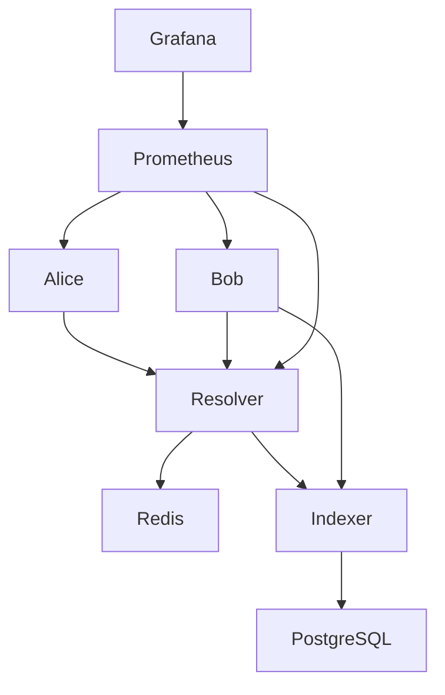

# Docker Infrastructure Context

## 1. Docker Infrastructure Fixes Applied

### Deno Version Alignment

- **Issue**: Lockfile version mismatch causing dependency resolution failures
- **Fix**: Updated all Dockerfiles from Deno 2.1.4 to 2.4.3 to match lockfile
  version 5
- **Impact**: Resolved "Unsupported lockfile version 5" errors

### User Permission Corrections

- **Issue**: Duplicate user creation causing build failures
- **Fix**: Removed redundant `adduser` commands as `deno` user already exists in
  base image
- **Impact**: Eliminated "user already exists" errors during builds

### Cache Directory Permissions

- **Issue**: DENO_DIR cache directories not writable by deno user
- **Fix**: Added explicit `chown -R deno:deno` commands for all cache
  directories
- **Locations Fixed**:
  - `/app/.cache` (DENO_DIR)
  - `/app/data/cache` (persistent cache)
  - `/app/data/kv` (KV storage)

### Import Map Configuration

- **Issue**: `nodeModulesDir` field not supported with import maps
- **Fix**: Removed `nodeModulesDir` from deno.json
- **Impact**: Eliminated configuration warnings

### Volume Mount Simplification

- **Issue**: Complex bind mounts causing permission issues
- **Fix**: Switched to named Docker volumes for better isolation
- **Volumes Created**:
  - `bmn-cache`: Shared Deno cache
  - `bmn-kv`: KV database storage
  - `bmn-secrets`: Secret storage
  - `bmn-redis`: Redis persistence

### Indexer Connectivity

- **Issue**: Services couldn't connect to indexer on host machine
- **Fix**: Changed INDEXER_URL to `http://host.docker.internal:42069`
- **Impact**: Services now successfully connect to indexer

### Docker Compose Version

- **Issue**: Deprecated version field causing warnings
- **Fix**: Removed `version: '3.8'` from docker-compose.yml
- **Impact**: Eliminated deprecation warnings

## 2. Current Service Architecture

### Core Services

#### Resolver (Port 8000)

- **Role**: Main coordination service for cross-chain swaps
- **Status**: Running but health check failing
- **Endpoints**:
  - `/health` - Health check endpoint
  - `/quote` - Get swap quotes
  - `/order` - Submit orders
- **Dependencies**: Redis, Indexer

#### Bob (Port 8002)

- **Role**: Swap acceptor/taker service
- **Status**: Running but health check failing
- **Function**: Monitors for orders to accept and execute
- **Dependencies**: Resolver, Indexer

#### Alice (Port 8001)

- **Role**: Swap initiator service
- **Status**: Keeps restarting (exits after showing help)
- **Issue**: Not running in daemon mode
- **Dependencies**: Resolver

### Supporting Services

#### Indexer (Port 42069)

- **Location**: Separate project at `../bmn-evm-contracts-indexer`
- **Role**: Indexes BMN blockchain events
- **Database**: PostgreSQL on port 5432
- **Status**: Running successfully
- **Tables**:
  - bmn_transfers
  - bmn_holders
  - limit_orders
  - atomic_swap_events

#### Redis (Port 6379)

- **Role**: Distributed caching and pub/sub
- **Status**: Running successfully
- **Used For**:
  - Order queue management
  - Service coordination
  - Cache layer

#### Prometheus (Port 9090)

- **Role**: Metrics collection
- **Status**: Restarting (config mount issue)
- **Issue**: prometheus.yml not properly mounted

#### Grafana (Port 3000)

- **Role**: Visualization dashboards
- **Status**: Running
- **Access**: http://localhost:3000 (admin/admin)

## 3. Configuration Changes Made

### docker-compose.yml

```yaml
# Removed deprecated version field
# version: '3.8' <- REMOVED

# Simplified volume configuration
volumes:
  bmn-cache:
  bmn-kv:
  bmn-secrets:
  bmn-redis:

# Fixed environment variables
INDEXER_URL: "http://host.docker.internal:42069"
DENO_DIR: "/app/.cache"
```

### Dockerfile Updates (All Services)

```dockerfile
# Updated base image
FROM denoland/deno:2.4.3

# Fixed cache permissions
RUN mkdir -p /app/.cache /app/data && \
    chown -R deno:deno /app

# Removed duplicate user creation
# RUN adduser ... <- REMOVED (user exists)
```

### deno.json

```json
{
  "tasks": { ... },
  "imports": { ... }
  // "nodeModulesDir": "auto" <- REMOVED
}
```

### Created Configuration Files

- `prometheus.yml`: Prometheus scrape configuration
- `grafana/provisioning/datasources/prometheus.yml`: Grafana datasource
- `grafana/provisioning/dashboards/dashboard.yml`: Dashboard configuration

## 4. Current Issues

### Health Check Failures

- **Affected**: Resolver and Bob services
- **Symptom**: Services marked as unhealthy after 30 seconds
- **Likely Cause**: Health endpoints not properly implemented or returning wrong
  status
- **Impact**: Docker reports services as unhealthy but they continue running

### Alice Service Restarts

- **Symptom**: Exits immediately after showing help text
- **Root Cause**: Not running in daemon/server mode
- **Current Behavior**: Shows CLI help and exits
- **Solution Needed**: Implement proper server mode or continuous monitoring
  loop

### Prometheus Configuration

- **Issue**: Config file not properly mounted
- **Error**: "Error loading config"
- **Fix Needed**: Correct volume mount for prometheus.yml

### Missing Health Endpoints

- **Services**: All core services lack proper health endpoints
- **Required Implementation**:
  ```typescript
  // Basic health endpoint
  app.get("/health", (c) => {
    return c.json({ status: "healthy", timestamp: Date.now() });
  });
  ```

## 5. Essential Commands

### Service Management

```bash
# Start all services with rebuild
docker-compose up -d --build && docker-compose logs

# Stop all services
docker-compose down

# Restart specific service
docker-compose restart resolver

# View real-time logs
docker-compose logs -f [service-name]

# Check service status
docker ps --format "table {{.Names}}\t{{.Status}}\t{{.Ports}}"
```

### Debugging

```bash
# Access container shell
docker-compose exec resolver sh

# Check container health
docker inspect bmn-evm-resolver-resolver-1 | grep -A 10 Health

# View service environment
docker-compose exec resolver env

# Test connectivity to indexer
docker-compose exec resolver curl http://host.docker.internal:42069/health
```

### Indexer Operations

```bash
# Start indexer (from indexer directory)
cd ../bmn-evm-contracts-indexer
docker-compose up -d

# Check indexed events
make -C ../bmn-evm-contracts-indexer check-events

# View indexer logs
cd ../bmn-evm-contracts-indexer && docker-compose logs -f
```

### Cleanup

```bash
# Stop and remove all containers
docker-compose down

# Remove all data volumes
docker-compose down -v

# Full reset
docker-compose down -v && rm -rf data/
```

## 6. Next Steps

### Priority 1: Fix Alice Service

```typescript
// Current: CLI mode that exits
// Needed: Server mode with continuous operation
// File: src/alice/mainnet-alice.ts
// Add server initialization and keep-alive logic
```

### Priority 2: Implement Health Endpoints

```typescript
// Add to each service (resolver.ts, bob.ts, alice.ts)
import { Hono } from "hono";

const app = new Hono();
app.get("/health", (c) => {
  const checks = {
    status: "healthy",
    timestamp: Date.now(),
    uptime: process.uptime(),
    checks: {
      redis: await checkRedis(),
      indexer: await checkIndexer(),
    },
  };
  return c.json(checks);
});
```

### Priority 3: Fix Prometheus Configuration

```yaml
# docker-compose.yml - fix volume mount
prometheus:
  volumes:
    - ./prometheus.yml:/etc/prometheus/prometheus.yml:ro
```

### Priority 4: Test Atomic Swap Flow

1. Ensure indexer is running and synced
2. Start all services
3. Create test swap via resolver API
4. Monitor logs for execution flow
5. Verify PostInteraction handling

### Priority 5: PostInteraction Integration

- Deploy updated SimplifiedEscrowFactory with IPostInteraction
- Update resolver to handle postInteraction callbacks
- Test escrow creation after order fills
- Verify token transfers to escrows

## 7. Service Dependencies



## 8. Known Working Configuration

### Environment Variables (.env)

```bash
# Chain configurations
CHAIN_IDS="8453,10,42161,1"
CHAIN_NAMES="base,optimism,arbitrum,ethereum"

# Service URLs
INDEXER_URL="http://host.docker.internal:42069"
REDIS_URL="redis://redis:6379"

# API Keys (use placeholders)
ANKR_API_KEY="your_ankr_api_key"
PRIVATE_KEY="your_private_key"
```

### Network Configuration

- All services on `bmn-network` Docker network
- Inter-service communication via service names
- Host access via `host.docker.internal`

## 9. Monitoring and Observability

### Current Metrics

- Service health status via Docker
- Redis connection status
- Indexer event counts

### Missing Metrics

- Order processing rates
- Swap success/failure rates
- Gas usage tracking
- Latency measurements

### Logging

- All services log to stdout/stderr
- Logs accessible via `docker-compose logs`
- No persistent log storage configured

## 10. Security Considerations

### Current Security Measures

- Non-root user execution (deno user)
- Read-only volume mounts where appropriate
- Environment variable isolation

### Security Improvements Needed

- Implement secrets management
- Add rate limiting
- Configure CORS properly
- Implement authentication for admin endpoints

---

**Document Version**: 1.0.0\
**Last Updated**: Current session\
**Status**: Infrastructure stabilized, services need implementation fixes
