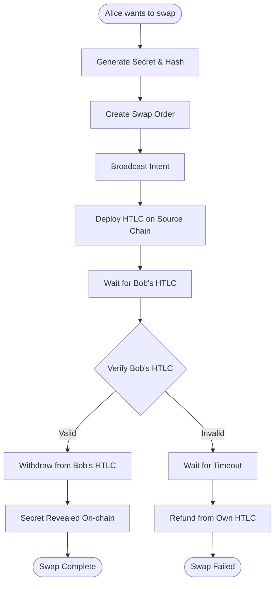

# Alice (Maker) Implementation

## Overview

Alice is the swap initiator who wants to exchange tokens from Chain A to Chain
B. She creates the initial HTLC and sets the terms of the swap.

## Alice's Complete Flow



## Implementation Components

### 1. Secret Management

```typescript
class SecretManager {
    private secrets: Map<string, SecretData> = new Map();
    
    interface SecretData {
        secret: string;
        hashlock: string;
        orderId: string;
        createdAt: number;
        usedAt?: number;
        status: 'pending' | 'revealed' | 'expired';
    }
    
    generateSecret(): { secret: string, hashlock: string } {
        // Generate cryptographically secure random secret
        const secret = crypto.randomBytes(32).toString('hex');
        const hashlock = keccak256(secret);
        
        // Store for later use
        this.secrets.set(hashlock, {
            secret,
            hashlock,
            createdAt: Date.now(),
            status: 'pending'
        });
        
        return { secret, hashlock };
    }
    
    revealSecret(hashlock: string): string {
        const data = this.secrets.get(hashlock);
        if (!data) throw new Error("Secret not found");
        if (data.status === 'revealed') throw new Error("Secret already revealed");
        
        data.status = 'revealed';
        data.usedAt = Date.now();
        
        return data.secret;
    }
}
```

### 2. Order Creation

```typescript
class AliceClient {
  async createSwapOrder(params: SwapParams): Promise<SwapOrder> {
    // Validate parameters
    this.validateSwapParams(params);

    // Generate secret
    const { secret, hashlock } = this.secretManager.generateSecret();

    // Calculate timeouts (Alice timeout > Bob timeout)
    const now = Math.floor(Date.now() / 1000);
    const bobTimeout = now + (4 * 3600); // 4 hours
    const aliceTimeout = now + (8 * 3600); // 8 hours

    // Create order object
    const order: SwapOrder = {
      id: generateOrderId(),
      maker: this.address,

      srcChain: params.srcChain,
      srcToken: params.srcToken,
      srcAmount: params.srcAmount,

      dstChain: params.dstChain,
      dstToken: params.dstToken,
      dstAmount: params.dstAmount,

      hashlock,
      aliceTimeout,
      bobTimeout,

      status: "created",
      createdAt: now,
    };

    // Store order
    await this.orderStore.save(order);

    return order;
  }
}
```

### 3. HTLC Deployment

```typescript
class HTLCDeployer {
  async deploySourceHTLC(order: SwapOrder): Promise<string> {
    // Get contract instance
    const htlc = this.getHTLCContract(order.srcChain);

    // Approve token transfer
    const token = this.getERC20Contract(order.srcToken, order.srcChain);
    await token.approve(htlc.address, order.srcAmount);

    // Deploy HTLC
    const tx = await htlc.createHTLC(
      ethers.constants.AddressZero, // Receiver not known yet
      order.srcToken,
      order.srcAmount,
      order.hashlock,
      order.aliceTimeout,
    );

    const receipt = await tx.wait();
    const contractId = this.extractContractId(receipt);

    // Update order
    order.srcEscrow = htlc.address;
    order.srcContractId = contractId;
    order.status = "alice_locked";

    return contractId;
  }
}
```

### 4. Monitoring Bob's HTLC

```typescript
class BobHTLCMonitor {
  async startMonitoring(order: SwapOrder): Promise<void> {
    const htlc = this.getHTLCContract(order.dstChain);

    // Listen for HTLC creation events
    const filter = htlc.filters.HTLCCreated(
      null, // any contractId
      null, // any sender
      order.maker, // receiver must be Alice
      order.dstToken,
      order.dstAmount,
      order.hashlock,
      null, // any timeout
    );

    htlc.on(filter, async (event) => {
      await this.handleBobHTLC(order, event);
    });

    // Also poll periodically as backup
    this.pollInterval = setInterval(async () => {
      await this.checkForBobHTLC(order);
    }, 10000); // every 10 seconds
  }

  async handleBobHTLC(order: SwapOrder, event: Event): Promise<void> {
    // Verify HTLC parameters
    if (!this.verifyBobHTLC(order, event)) {
      console.error("Invalid Bob HTLC");
      return;
    }

    // Update order
    order.taker = event.sender;
    order.dstEscrow = event.address;
    order.dstContractId = event.contractId;
    order.status = "bob_locked";

    // Trigger withdrawal
    await this.withdrawFromBobHTLC(order);
  }
}
```

### 5. Withdrawal Process

```typescript
class AliceWithdrawer {
  async withdrawFromDestination(order: SwapOrder): Promise<void> {
    // Get secret
    const secret = this.secretManager.getSecret(order.hashlock);

    // Get HTLC contract
    const htlc = this.getHTLCContract(order.dstChain);

    // Withdraw (this reveals the secret on-chain)
    const tx = await htlc.withdraw(order.dstContractId, secret);
    const receipt = await tx.wait();

    // Verify success
    if (!receipt.status) {
      throw new Error("Withdrawal failed");
    }

    // Update order
    order.status = "alice_withdrawn";
    order.secretRevealedAt = Date.now();
    order.secretRevealTx = receipt.transactionHash;

    console.log("Successfully withdrew from destination");
    console.log("Secret revealed on-chain:", secret);
  }
}
```

### 6. Refund Process

```typescript
class AliceRefunder {
  async checkAndRefund(order: SwapOrder): Promise<void> {
    const now = Math.floor(Date.now() / 1000);

    // Check if timeout reached
    if (now < order.aliceTimeout) {
      console.log("Timeout not reached yet");
      return;
    }

    // Check if Bob deployed HTLC
    if (order.status === "alice_locked") {
      // Bob never responded, refund
      await this.refundHTLC(order);
    }
  }

  async refundHTLC(order: SwapOrder): Promise<void> {
    const htlc = this.getHTLCContract(order.srcChain);

    const tx = await htlc.refund(order.srcContractId);
    const receipt = await tx.wait();

    if (!receipt.status) {
      throw new Error("Refund failed");
    }

    order.status = "refunded";
    order.refundedAt = Date.now();

    console.log("Successfully refunded");
  }
}
```

## Configuration

### Network Configuration

```typescript
interface NetworkConfig {
  chainId: number;
  name: string;
  rpcUrl: string;
  htlcAddress: string;
  blockTime: number; // seconds
  confirmations: number;
}

const NETWORKS: Record<string, NetworkConfig> = {
  base: {
    chainId: 8453,
    name: "Base",
    rpcUrl: process.env.BASE_RPC_URL,
    htlcAddress: "0x...",
    blockTime: 2,
    confirmations: 3,
  },
  optimism: {
    chainId: 10,
    name: "Optimism",
    rpcUrl: process.env.OPTIMISM_RPC_URL,
    htlcAddress: "0x...",
    blockTime: 2,
    confirmations: 3,
  },
};
```

### Timeout Configuration

```typescript
interface TimeoutConfig {
  minDuration: number; // minimum timeout duration in seconds
  maxDuration: number; // maximum timeout duration
  aliceBuffer: number; // extra time Alice gets vs Bob
}

const TIMEOUT_CONFIG: TimeoutConfig = {
  minDuration: 3600, // 1 hour minimum
  maxDuration: 86400, // 24 hours maximum
  aliceBuffer: 7200, // Alice gets 2 hours more than Bob
};
```

## Error Handling

### Critical Errors

1. **Secret Loss**
   - Backup secrets to persistent storage
   - Implement recovery mechanism

2. **Network Issues**
   - Retry with exponential backoff
   - Use multiple RPC endpoints

3. **Insufficient Balance**
   - Check balance before creating HTLC
   - Monitor for balance changes

### Recovery Strategies

```typescript
class RecoveryManager {
  async recoverFromFailure(order: SwapOrder): Promise<void> {
    switch (order.status) {
      case "alice_locked":
        // Wait for timeout then refund
        await this.scheduleRefund(order);
        break;

      case "bob_locked":
        // Try to withdraw again
        await this.retryWithdrawal(order);
        break;

      case "alice_withdrawn":
        // Success, nothing to recover
        break;

      default:
        console.error("Unknown status:", order.status);
    }
  }
}
```

## CLI Interface

```bash
# Create a new swap
alice create \
  --from base:USDC:100 \
  --to optimism:USDT:100 \
  --timeout 4h

# List active swaps
alice list --status active

# Withdraw from specific swap
alice withdraw --order-id abc123

# Refund expired swap
alice refund --order-id abc123

# Monitor all swaps
alice monitor --auto-withdraw --auto-refund
```

## Best Practices

1. **Always generate fresh secrets** - Never reuse secrets across swaps
2. **Store secrets securely** - Use encrypted storage
3. **Monitor actively** - Don't rely solely on events
4. **Set appropriate timeouts** - Consider network congestion
5. **Implement retry logic** - Handle transient failures
6. **Log everything** - For debugging and audit trail
7. **Test on testnets first** - Ensure everything works
8. **Have emergency procedures** - Plan for worst case

## Testing Alice Implementation

### Unit Tests

- Secret generation and management
- Order creation and validation
- HTLC interaction logic
- Timeout calculations

### Integration Tests

- Full swap flow with mock Bob
- Timeout and refund scenarios
- Network failure handling
- Recovery procedures

### End-to-End Tests

- Deploy on testnets
- Execute real swaps
- Test edge cases
- Measure performance
