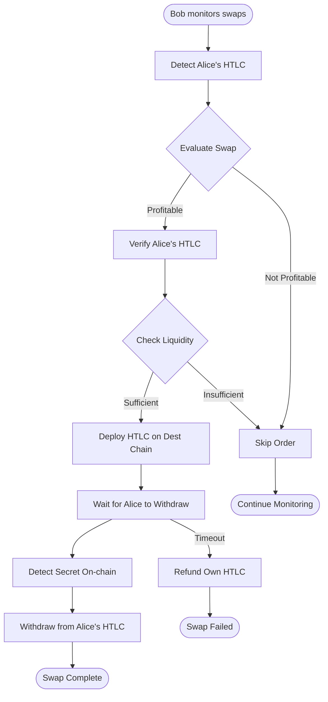

# Bob (Taker/Resolver) Implementation

## Overview

Bob is the swap acceptor who monitors for Alice's swap offers, evaluates them,
and completes the atomic swap by creating a matching HTLC on the destination
chain.

## Bob's Complete Flow



## Implementation Components

### 1. Order Discovery

```typescript
class OrderDiscovery {
  private providers: Map<number, ethers.Provider> = new Map();
  private htlcContracts: Map<number, Contract> = new Map();

  async startMonitoring(chains: ChainConfig[]): Promise<void> {
    for (const chain of chains) {
      await this.monitorChain(chain);
    }
  }

  async monitorChain(chain: ChainConfig): Promise<void> {
    const provider = new ethers.providers.JsonRpcProvider(chain.rpcUrl);
    const htlc = new ethers.Contract(chain.htlcAddress, HTLC_ABI, provider);

    // Listen for new HTLCs
    htlc.on("HTLCCreated", async (
      contractId,
      sender,
      receiver,
      token,
      amount,
      hashlock,
      timeout,
      event,
    ) => {
      await this.handleNewHTLC({
        contractId,
        sender,
        receiver,
        token,
        amount,
        hashlock,
        timeout,
        chainId: chain.chainId,
        txHash: event.transactionHash,
        blockNumber: event.blockNumber,
      });
    });

    this.providers.set(chain.chainId, provider);
    this.htlcContracts.set(chain.chainId, htlc);
  }
}
```

### 2. Swap Evaluation

```typescript
class SwapEvaluator {
    interface EvaluationResult {
        profitable: boolean;
        expectedProfit: BigNumber;
        risks: Risk[];
        recommendation: 'accept' | 'reject' | 'manual_review';
    }
    
    async evaluateSwap(htlcData: HTLCData): Promise<EvaluationResult> {
        // Get current prices
        const srcPrice = await this.getTokenPrice(htlcData.token, htlcData.chainId);
        const dstPrice = await this.getTokenPrice(
            this.getDestToken(htlcData), 
            this.getDestChain(htlcData)
        );
        
        // Calculate values
        const srcValue = htlcData.amount.mul(srcPrice);
        const dstValue = this.calculateRequiredDstAmount(htlcData).mul(dstPrice);
        
        // Calculate costs
        const gasCosts = await this.estimateGasCosts(htlcData);
        const slippage = this.calculateSlippage(srcValue, dstValue);
        
        // Calculate profit
        const profit = srcValue.sub(dstValue).sub(gasCosts).sub(slippage);
        
        // Risk assessment
        const risks = await this.assessRisks(htlcData);
        
        // Make recommendation
        const profitable = profit.gt(this.minProfit);
        const acceptable = risks.every(r => r.level !== 'high');
        
        return {
            profitable,
            expectedProfit: profit,
            risks,
            recommendation: profitable && acceptable ? 'accept' : 'reject'
        };
    }
    
    async assessRisks(htlcData: HTLCData): Promise<Risk[]> {
        const risks: Risk[] = [];
        
        // Timeout risk
        const timeRemaining = htlcData.timeout - Date.now() / 1000;
        if (timeRemaining < 3600) {
            risks.push({
                type: 'timeout',
                level: 'high',
                description: 'Less than 1 hour remaining'
            });
        }
        
        // Liquidity risk
        const liquidity = await this.checkLiquidity(
            htlcData.token,
            htlcData.amount,
            htlcData.chainId
        );
        if (liquidity.lt(htlcData.amount.mul(2))) {
            risks.push({
                type: 'liquidity',
                level: 'medium',
                description: 'Low liquidity for token'
            });
        }
        
        // Network risk
        const congestion = await this.checkNetworkCongestion(htlcData.chainId);
        if (congestion > 0.8) {
            risks.push({
                type: 'network',
                level: 'medium',
                description: 'Network congestion detected'
            });
        }
        
        return risks;
    }
}
```

### 3. Liquidity Management

```typescript
class LiquidityManager {
  private balances: Map<string, BigNumber> = new Map();
  private reservedAmounts: Map<string, BigNumber> = new Map();

  async checkAvailability(
    token: string,
    amount: BigNumber,
    chainId: number,
  ): Promise<boolean> {
    const key = `${chainId}:${token}`;
    const balance = await this.getBalance(token, chainId);
    const reserved = this.reservedAmounts.get(key) || BigNumber.from(0);
    const available = balance.sub(reserved);

    return available.gte(amount);
  }

  async reserveFunds(
    token: string,
    amount: BigNumber,
    chainId: number,
    orderId: string,
  ): Promise<void> {
    const key = `${chainId}:${token}`;
    const current = this.reservedAmounts.get(key) || BigNumber.from(0);
    this.reservedAmounts.set(key, current.add(amount));

    // Track reservation
    this.reservations.set(orderId, {
      token,
      amount,
      chainId,
      reservedAt: Date.now(),
    });
  }

  async releaseFunds(orderId: string): Promise<void> {
    const reservation = this.reservations.get(orderId);
    if (!reservation) return;

    const key = `${reservation.chainId}:${reservation.token}`;
    const current = this.reservedAmounts.get(key) || BigNumber.from(0);
    this.reservedAmounts.set(key, current.sub(reservation.amount));

    this.reservations.delete(orderId);
  }
}
```

### 4. HTLC Response Deployment

```typescript
class BobHTLCDeployer {
  async deployResponseHTLC(
    aliceHTLC: HTLCData,
    evaluation: EvaluationResult,
  ): Promise<string> {
    // Calculate Bob's timeout (must be less than Alice's)
    const aliceTimeout = aliceHTLC.timeout;
    const bobTimeout = aliceTimeout - (2 * 3600); // 2 hours less

    if (bobTimeout < Date.now() / 1000 + 3600) {
      throw new Error("Insufficient time for safe execution");
    }

    // Get destination chain details
    const dstChain = this.getDstChain(aliceHTLC);
    const dstToken = this.getDstToken(aliceHTLC);
    const dstAmount = this.getDstAmount(aliceHTLC);

    // Reserve funds
    await this.liquidityManager.reserveFunds(
      dstToken,
      dstAmount,
      dstChain,
      aliceHTLC.contractId,
    );

    // Deploy HTLC
    const htlc = this.getHTLCContract(dstChain);
    const token = this.getERC20Contract(dstToken, dstChain);

    // Approve token transfer
    await token.approve(htlc.address, dstAmount);

    // Create HTLC
    const tx = await htlc.createHTLC(
      aliceHTLC.sender, // Alice is the receiver
      dstToken,
      dstAmount,
      aliceHTLC.hashlock, // Same hashlock as Alice
      bobTimeout,
    );

    const receipt = await tx.wait();
    const contractId = this.extractContractId(receipt);

    // Store mapping
    await this.storage.saveSwapPair({
      aliceHTLC: aliceHTLC.contractId,
      aliceChain: aliceHTLC.chainId,
      bobHTLC: contractId,
      bobChain: dstChain,
      hashlock: aliceHTLC.hashlock,
      status: "bob_deployed",
      deployedAt: Date.now(),
    });

    return contractId;
  }
}
```

### 5. Secret Detection

```typescript
class SecretDetector {
  private watchedContracts: Map<string, WatchedContract> = new Map();

  async watchForSecret(
    contractId: string,
    chainId: number,
    hashlock: string,
  ): Promise<string> {
    return new Promise((resolve, reject) => {
      const htlc = this.getHTLCContract(chainId);

      // Listen for withdrawal event
      const filter = htlc.filters.HTLCWithdrawn(contractId);

      const timeout = setTimeout(() => {
        htlc.removeAllListeners(filter);
        reject(new Error("Timeout waiting for secret"));
      }, 4 * 3600 * 1000); // 4 hour timeout

      htlc.on(filter, async (contractId, secret, event) => {
        clearTimeout(timeout);
        htlc.removeAllListeners(filter);

        // Verify secret matches hashlock
        const computedHash = ethers.utils.keccak256(secret);
        if (computedHash !== hashlock) {
          reject(new Error("Invalid secret revealed"));
          return;
        }

        resolve(secret);
      });

      // Also poll as backup
      this.startPolling(contractId, chainId, hashlock, resolve, reject);
    });
  }

  private async startPolling(
    contractId: string,
    chainId: number,
    hashlock: string,
    resolve: Function,
    reject: Function,
  ): Promise<void> {
    const interval = setInterval(async () => {
      try {
        const htlc = this.getHTLCContract(chainId);
        const contract = await htlc.getContract(contractId);

        if (contract.withdrawn) {
          // Secret was revealed, need to find it
          const secret = await this.findSecretInHistory(
            contractId,
            chainId,
            hashlock,
          );
          clearInterval(interval);
          resolve(secret);
        }

        if (contract.refunded) {
          clearInterval(interval);
          reject(new Error("Contract was refunded"));
        }
      } catch (error) {
        console.error("Polling error:", error);
      }
    }, 10000); // Poll every 10 seconds
  }
}
```

### 6. Withdrawal Execution

```typescript
class BobWithdrawer {
  async executeWithdrawal(
    swapPair: SwapPair,
    secret: string,
  ): Promise<void> {
    try {
      // Get Alice's HTLC
      const htlc = this.getHTLCContract(swapPair.aliceChain);

      // Withdraw using revealed secret
      const tx = await htlc.withdraw(swapPair.aliceHTLC, secret);
      const receipt = await tx.wait();

      if (!receipt.status) {
        throw new Error("Withdrawal failed");
      }

      // Update status
      swapPair.status = "completed";
      swapPair.completedAt = Date.now();
      swapPair.secret = secret;
      await this.storage.updateSwapPair(swapPair);

      // Release reserved funds
      await this.liquidityManager.releaseFunds(swapPair.aliceHTLC);

      console.log("Successfully completed swap:", swapPair.aliceHTLC);
    } catch (error) {
      console.error("Withdrawal failed:", error);

      // Try to refund Bob's HTLC if possible
      await this.attemptRefund(swapPair);
      throw error;
    }
  }

  async attemptRefund(swapPair: SwapPair): Promise<void> {
    const now = Math.floor(Date.now() / 1000);
    const htlc = this.getHTLCContract(swapPair.bobChain);
    const contract = await htlc.getContract(swapPair.bobHTLC);

    if (now >= contract.timeout && !contract.withdrawn && !contract.refunded) {
      const tx = await htlc.refund(swapPair.bobHTLC);
      await tx.wait();
      console.log("Refunded Bob's HTLC:", swapPair.bobHTLC);
    }
  }
}
```

## Configuration

### Bot Configuration

```typescript
interface BobConfig {
  // Operational parameters
  minProfit: BigNumber; // Minimum profit to accept swap
  maxExposure: BigNumber; // Maximum value at risk
  maxConcurrentSwaps: number; // Limit concurrent swaps

  // Timing parameters
  minTimeBuffer: number; // Minimum time before timeout (seconds)
  responseDelay: number; // Delay before responding (seconds)

  // Risk parameters
  maxSlippage: number; // Maximum acceptable slippage (basis points)
  requiredConfirmations: number; // Block confirmations required

  // Network parameters
  chains: ChainConfig[]; // Chains to monitor
  tokens: TokenConfig[]; // Tokens to support
}

const DEFAULT_CONFIG: BobConfig = {
  minProfit: ethers.utils.parseEther("0.01"),
  maxExposure: ethers.utils.parseEther("1000"),
  maxConcurrentSwaps: 10,
  minTimeBuffer: 3600,
  responseDelay: 30,
  maxSlippage: 100, // 1%
  requiredConfirmations: 3,
  chains: [/* ... */],
  tokens: [/* ... */],
};
```

### Profit Calculation

```typescript
class ProfitCalculator {
  calculateExpectedProfit(swap: SwapData): ProfitBreakdown {
    // Get token prices
    const srcPrice = this.getPrice(swap.srcToken);
    const dstPrice = this.getPrice(swap.dstToken);

    // Calculate values
    const srcValue = swap.srcAmount * srcPrice;
    const dstCost = swap.dstAmount * dstPrice;

    // Calculate fees
    const srcGas = this.estimateGas("withdraw", swap.srcChain);
    const dstGas = this.estimateGas("create", swap.dstChain);
    const totalGas = srcGas + dstGas;

    // Calculate profit
    const grossProfit = srcValue - dstCost;
    const netProfit = grossProfit - totalGas;

    return {
      srcValue,
      dstCost,
      grossProfit,
      gasCosts: totalGas,
      netProfit,
      profitMargin: (netProfit / dstCost) * 100,
    };
  }
}
```

## Monitoring Dashboard

```typescript
class BobDashboard {
  getStatus(): DashboardData {
    return {
      // System status
      uptime: this.getUptime(),
      health: this.checkHealth(),

      // Swap statistics
      activeSwaps: this.activeSwaps.size,
      completedSwaps: this.completedCount,
      failedSwaps: this.failedCount,
      totalProfit: this.totalProfit,

      // Liquidity status
      balances: this.getBalances(),
      reserved: this.getReservedAmounts(),
      available: this.getAvailableAmounts(),

      // Performance metrics
      avgResponseTime: this.calculateAvgResponseTime(),
      successRate: this.calculateSuccessRate(),
      profitPerSwap: this.calculateAvgProfit(),
    };
  }
}
```

## Error Handling

### Recovery Procedures

```typescript
class RecoveryManager {
  async handleFailure(error: Error, context: SwapContext): Promise<void> {
    switch (error.type) {
      case "INSUFFICIENT_FUNDS":
        await this.handleInsufficientFunds(context);
        break;

      case "NETWORK_ERROR":
        await this.retryWithBackoff(context);
        break;

      case "TIMEOUT_APPROACHING":
        await this.emergencyRefund(context);
        break;

      case "SECRET_NOT_FOUND":
        await this.investigateSecret(context);
        break;

      default:
        await this.logAndAlert(error, context);
    }
  }
}
```

## CLI Interface

```bash
# Start Bob resolver
bob start --config config.json

# Monitor active swaps
bob status

# List profitable opportunities
bob opportunities --min-profit 0.01

# Execute specific swap
bob execute --swap-id abc123

# Emergency refund
bob refund --contract-id xyz789

# Check liquidity
bob liquidity --token USDC --chain optimism
```

## Best Practices

1. **Always verify Alice's HTLC** before deploying yours
2. **Monitor multiple RPCs** for redundancy
3. **Set conservative timeouts** to avoid race conditions
4. **Maintain sufficient liquidity** across chains
5. **Implement circuit breakers** for risk management
6. **Log all transactions** for audit and debugging
7. **Use flashloan protection** if needed
8. **Monitor gas prices** and adjust accordingly
9. **Implement MEV protection** where applicable
10. **Regular security audits** of bot code
