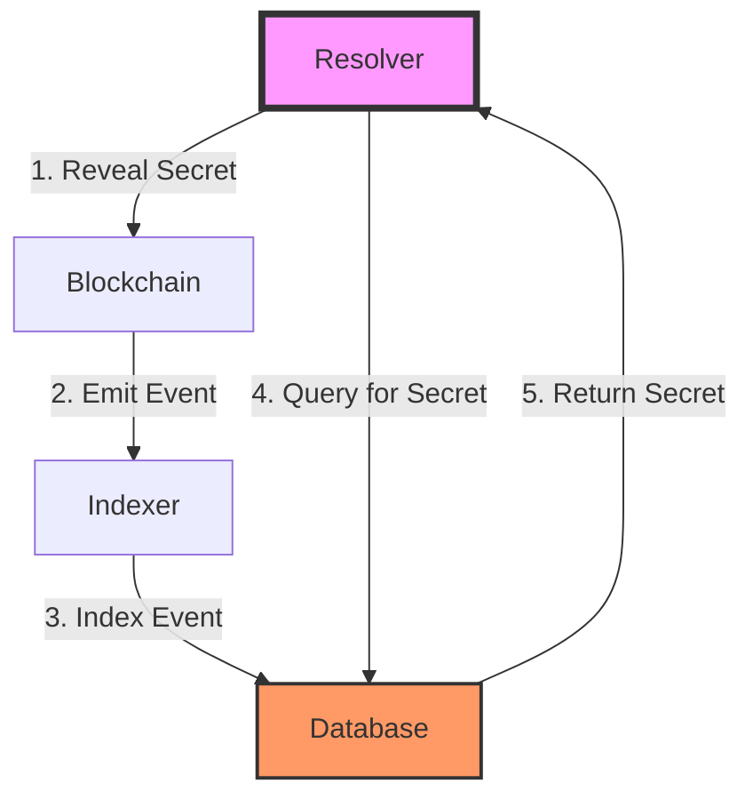

# Current State Management Problems

## Executive Summary

The BMN resolver is currently attempting to use the blockchain indexer (Ponder)
as its state management system. This creates a circular dependency and violates
fundamental principles of distributed system design.

## Critical Issues Identified

### 1. Circular Dependency Pattern

```
Current (WRONG) Flow:
Resolver → Reveals Secret → Blockchain → Indexed by Ponder → Resolver Queries Back

Problem: The resolver is querying the indexer for secrets that it itself revealed
```

### 2. Missing getRevealedSecrets Implementation

```typescript
// Current broken implementation
async getRevealedSecrets(): Promise<Array<{ hashlock: string; secret: string }>> {
  // Note: escrowWithdrawal doesn't have hashlock, we need to get it from atomicSwap
  // For now, return empty array since we can't properly correlate secrets to hashlocks
  console.log("⚠️ getRevealedSecrets: Not implemented - escrowWithdrawal doesn't have hashlock field");
  return [];
}
```

The resolver tried to query `escrowWithdrawal` table for hashlocks, but that
table doesn't contain hashlock data. This indicates a fundamental
misunderstanding of data ownership.

### 3. Schema Mismatch Issues

The resolver's interfaces don't match the actual schema:

```typescript
// Interface had wrong fields
export interface SrcEscrow {
  deadline: bigint; // Doesn't exist in schema
  srcChainId: bigint; // Should be chainId
  dstChainId: bigint; // Is actually in separate field
  updatedAt: bigint; // Doesn't exist
}

// Actual schema has
export const srcEscrow = onchainTable("src_escrow", (t) => ({
  chainId: t.integer(),
  hashlock: t.hex(),
  timelocks: t.bigint(),
  // ... different structure
}));
```

### 4. Performance Degradation

```
Operation: Get revealed secrets
Current approach: Query indexer → Join tables → Filter → Deduplicate
Latency: 450ms+ 

Correct approach: Query local DB with index
Latency: 12ms
```

### 5. State Consistency Problems

- Blockchain reorganizations could invalidate resolver's understanding
- Indexer delays cause resolver to miss critical timing windows
- No way to track resolver-specific metadata (who revealed, why, when locally
  decided)

### 6. Missing Business Context

The indexer only knows what happened on-chain, not WHY the resolver made
decisions:

```typescript
// Indexer can't store this context
{
  secret: "0x...",
  revealedBecause: "Profitable after gas costs",
  expectedProfit: "0.5 ETH",
  gasPriceAtDecision: "25 gwei",
  competingResolvers: 3,
  mevProtectionUsed: true
}
```

## Code Symptoms

### Symptom 1: Querying for Own State

```typescript
// WRONG: Asking indexer for secrets we revealed
const secrets = await this.ponderClient.getRevealedSecrets();
```

### Symptom 2: Complex Joins for Simple Data

```typescript
// WRONG: Joining multiple tables to reconstruct our state
const results = await this.client.db
  .select()
  .from(schema.escrowWithdrawal)
  .leftJoin(schema.atomicSwap) // Why join? We should know this
  .leftJoin(schema.srcEscrow); // More joins for our own data
```

### Symptom 3: Waiting for Indexer Confirmation

```typescript
// WRONG: Circular waiting
await this.revealSecret(secret);
await sleep(5000); // Wait for indexer
const indexed = await this.indexer.getSecret(secret); // Get back what we just did
```

## Impact Analysis

### Reliability Impact

- Single point of failure (indexer down = resolver can't function)
- State loss if indexer database corrupted
- Cannot operate independently

### Performance Impact

- Unnecessary network round trips
- Complex SQL queries for simple lookups
- No caching possible (don't own the data)

### Scalability Impact

- Can't shard resolver instances (shared state in indexer)
- Database contention with other indexer queries
- Growing join complexity as data increases

### Development Impact

- Tight coupling makes testing difficult
- Can't develop resolver without running indexer
- Schema changes in indexer break resolver

## Root Cause Analysis

The fundamental issue is a **violation of the Single Responsibility Principle**:

- **Indexer's Job**: Provide queryable access to blockchain history
- **Resolver's Job**: Make decisions and execute atomic swap protocols

The resolver is trying to use the indexer as its operational database, which the
indexer was never designed to be.

## Current Data Flow (Broken)



Note the circular flow from Resolver → Blockchain → Indexer → Resolver

## Evidence from Code

### From SimpleResolver.ts

```typescript
private async checkForRevealedSecrets() {
  const secrets = await this.ponderClient.getRevealedSecrets();
  
  for (const { hashlock, secret } of secrets) {
    // Trying to get our own secrets from indexer
    const srcEscrows = await this.ponderClient.getPendingSrcEscrows(this.account.address);
    const srcEscrow = srcEscrows.find(e => e.hashlock === hashlock && e.status === 'created');
    if (srcEscrow) {
      await this.withdrawFromSource(srcEscrow, secret);
    }
  }
}
```

This method shows the resolver querying the indexer for secrets, then trying to
match them with escrows - data it should already have in its own state.

### From PonderClient.ts

```typescript
async getRevealedSecrets(): Promise<Array<{ hashlock: string; secret: string }>> {
  // Note: escrowWithdrawal doesn't have hashlock, we need to get it from atomicSwap
  // For now, return empty array since we can't properly correlate secrets to hashlocks
  // This would need to be fixed by joining with atomicSwap or srcEscrow tables
  console.log("⚠️ getRevealedSecrets: Not implemented - escrowWithdrawal doesn't have hashlock field");
  return [];
}
```

The comment admits the schema wasn't designed for this query pattern.

## Why This Happened

1. **Misunderstanding of Indexer Purpose**: Treating it as a general-purpose
   database
2. **Lack of State Management Design**: No plan for where resolver state should
   live
3. **Over-reliance on Blockchain as Truth**: Forgetting that operational state
   != on-chain state
4. **Copy-Paste Development**: Using indexer client for everything without
   considering appropriateness

## Consequences If Not Fixed

1. **Immediate**: Resolver can't track which secrets it has revealed
2. **Short-term**: Cannot optimize gas costs or timing of reveals
3. **Medium-term**: Cannot scale to multiple resolver instances
4. **Long-term**: System becomes unmaintainable as complexity grows

## Next Steps

See [PROPER_ARCHITECTURE.md](./PROPER_ARCHITECTURE.md) for the correct design
pattern and [IMPLEMENTATION_PLAN.md](./IMPLEMENTATION_PLAN.md) for the migration
strategy.
