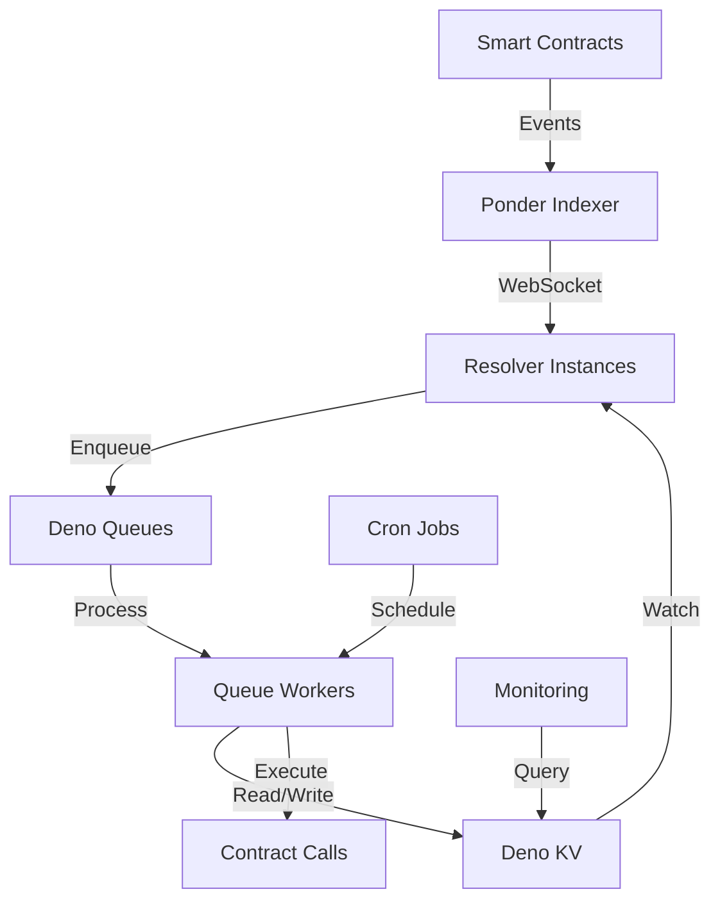

# Bridge-Me-Not Resolver: Final Execution Plan

## Executive Summary

This comprehensive execution plan synthesizes seven key proposals to transform the Bridge-Me-Not resolver from a prototype into a production-ready, enterprise-scale cross-chain atomic swap system. By integrating Deno KV, Queues, Cron, and the Ponder indexer with the updated CREATE3-based contracts, we create a modern, scalable architecture that addresses all current limitations while preparing for future growth.

### Unified Vision

The modernized resolver will be a distributed, event-driven system that:
- **Discovers orders** in real-time through Ponder indexer WebSocket connections
- **Processes swaps** asynchronously using Deno Queues with automatic retry mechanisms
- **Manages state** atomically with Deno KV, enabling multi-instance deployments
- **Monitors timelocks** precisely using Deno Cron scheduled tasks
- **Handles failures** gracefully with dead letter queues and alerting
- **Scales horizontally** across multiple instances without coordination overhead

### Key Transformations

1. **From Polling to Event-Driven**: Replace RPC polling with indexer subscriptions (90% RPC reduction)
2. **From Files to KV**: Migrate state management to atomic KV operations (10x performance improvement)
3. **From Sequential to Parallel**: Process orders through message queues (10x throughput increase)
4. **From Manual to Automated**: Schedule critical tasks with Cron (99.9% timelock reliability)
5. **From Single to Multi-Instance**: Enable horizontal scaling with distributed locks

### Implementation Phases

- **Phase 1**: Foundation - KV integration and basic indexer setup
- **Phase 2**: Event Processing - Queue implementation and advanced indexer features
- **Phase 3**: Automation - Cron jobs and monitoring systems
- **Phase 4**: Production Deployment - Performance optimization and go-live

### Resource Requirements

- **Team**: 1 Senior Developer (full-time), 1 DevOps Engineer (50%), 1 QA Engineer (50%)
- **Infrastructure**: ~$500/month for cloud resources
- **Budget**: ~$40,000 including development and initial infrastructure

## Integrated Architecture

### System Overview

```
┌─────────────────────────────────────────────────────────────────────────────┐
│                         Bridge-Me-Not Protocol                               │
├─────────────────────────────────┬───────────────────────────────────────────┤
│        Source Chain             │           Destination Chain                │
│  • CrossChainEscrowFactory      │     • CrossChainEscrowFactory             │
│  • EscrowSrc Contracts          │     • EscrowDst Contracts                 │
│  • BMN Token                    │     • BMN Token                          │
└────────────────┬────────────────┴────────────────┬──────────────────────────┘
                 │                                 │
                 │         WebSocket Events        │
                 └──────────────┬──────────────────┘
                                │
                        ┌───────┴────────┐
                        │ Ponder Indexer │
                        │                │
                        │ • Event Parser │
                        │ • PostgreSQL   │
                        │ • GraphQL API  │
                        └───────┬────────┘
                                │
                    ┌───────────┴──────────────┐
                    │                          │
            ┌───────┴────────┐        ┌───────┴────────┐
            │  Deno Resolver │        │  Deno Resolver │
            │   Instance 1   │        │   Instance 2   │
            │                │        │                │
            │ • KV Store     │        │ • KV Store     │
            │ • Queue Worker │        │ • Queue Worker │
            │ • Cron Jobs    │        │ • Cron Jobs    │
            │ • Indexer Client        │ • Indexer Client
            └────────────────┘        └────────────────┘
                    │                          │
                    └───────────┬──────────────┘
                                │
                        ┌───────┴────────┐
                        │   Deno KV      │
                        │                │
                        │ • Order State  │
                        │ • Secrets      │
                        │ • Locks        │
                        │ • Metrics      │
                        └────────────────┘
```

### Component Interactions

#### 1. Order Discovery Flow
```
Blockchain Event → Ponder Indexer → GraphQL Subscription → Queue Message → KV State Update
```

#### 2. Order Execution Flow
```
Queue Worker → KV Lock Acquire → Contract Interaction → KV State Update → Queue Next Step
```

#### 3. Secret Monitoring Flow
```
Cron Job → Indexer Query → Secret Detection → Queue Message → Source Withdrawal
```

#### 4. Health Monitoring Flow
```
Cron Job → Component Health Checks → KV Metrics → Alert System
```

### Data Flow Diagram



## Implementation Roadmap

### Phase 1: Foundation

#### KV Integration and Contract Updates

**Objectives:**
- Implement Deno KV for state management
- Update resolver for CREATE3 contract addresses
- Set up parallel operation with existing system

**Tasks:**

1. **KV Infrastructure Setup**
   ```typescript
   // src/kv/index.ts
   export * from "./client.ts";
   export * from "./stores/order-store.ts";
   export * from "./stores/secret-store.ts";
   export * from "./stores/metrics-store.ts";
   export * from "./locks.ts";
   ```

2. **Contract Address Updates**
   ```typescript
   // src/config/contracts.ts
   export const CONTRACT_ADDRESSES = {
     ESCROW_FACTORY: "0x75ee15F6BfDd06Aee499ed95e8D92a114659f4d1",
     BMN_TOKEN: "0x8287CD2aC7E227D9D927F998EB600a0683a832A1",
   };
   ```

3. **Migration Scripts**
   ```bash
   deno run --allow-read --allow-write scripts/migrate-to-kv.ts
   deno run scripts/verify-migration.ts
   ```

**Deliverables:**
- [ ] KV client implementation with atomic operations
- [ ] Order store with status indexing
- [ ] Migration script for existing state files
- [ ] Updated contract configurations
- [ ] Parallel operation metrics dashboard

#### Basic Indexer Setup

**Objectives:**
- Deploy Ponder indexer with BMN contracts
- Implement indexer client in resolver
- Set up event subscriptions

**Tasks:**

1. **Indexer Configuration**
   ```typescript
   // bmn-evm-indexer/ponder.config.ts
   export default createConfig({
     contracts: {
       escrowFactory: {
         abi: crossChainEscrowFactoryAbi,
         address: CONTRACT_ADDRESSES.ESCROW_FACTORY,
         startBlock: 0,
       }
     }
   });
   ```

2. **Indexer Client Implementation**
   ```typescript
   // src/indexer/client.ts
   export class IndexerClient {
     async subscribeToOrders(callback: (order: IndexedOrder) => void);
     async queryPendingOrders(resolver: Address): Promise<IndexedOrder[]>;
     async getRevealedSecret(orderHash: string): Promise<string | null>;
   }
   ```

3. **Docker Deployment**
   ```yaml
   # docker-compose.yml
   services:
     postgres:
       image: postgres:15
     indexer:
       image: bmn-indexer:latest
       depends_on: [postgres]
   ```

**Deliverables:**
- [ ] Ponder indexer deployed and syncing
- [ ] GraphQL API operational
- [ ] Indexer client integrated in resolver
- [ ] Real-time order discovery working
- [ ] Performance comparison metrics

### Phase 2: Event Processing

#### Queue Implementation

**Objectives:**
- Implement Deno Queues for order processing
- Set up message handlers for all operations
- Configure retry policies and DLQ

**Tasks:**

1. **Queue Manager Setup**
   ```typescript
   // src/queues/manager.ts
   export class QueueManager {
     async initialize(): Promise<void>;
     async enqueue<T extends QueueMessage>(queue: string, message: T): Promise<void>;
     async startListening(queue: string): Promise<void>;
   }
   ```

2. **Message Handler Implementation**
   ```typescript
   // src/queues/handlers/index.ts
   export { NewOrderHandler } from "./new-order.ts";
   export { DeployEscrowHandler } from "./deploy-escrow.ts";
   export { SecretMonitorHandler } from "./secret-monitor.ts";
   export { WithdrawHandler } from "./withdraw.ts";
   ```

3. **Queue Configuration**
   ```typescript
   // src/queues/config.ts
   export const QUEUE_CONFIG = {
     queues: {
       orderDiscovery: "orders:discovery",
       orderExecution: "orders:execution",
       secretMonitoring: "orders:monitoring",
     },
     retryPolicies: {
       [MessageType.DEPLOY_DST_ESCROW]: {
         maxRetries: 3,
         initialDelay: 5000,
         backoffMultiplier: 2,
       }
     }
   };
   ```

**Deliverables:**
- [ ] Queue manager with retry logic
- [ ] All message handlers implemented
- [ ] Dead letter queue for failed messages
- [ ] Queue depth monitoring
- [ ] Integration tests passing

#### Advanced Indexer Features

**Objectives:**
- Implement complex indexer queries
- Add WebSocket subscriptions
- Set up indexer-queue integration

**Tasks:**

1. **Advanced Queries**
   ```typescript
   // src/indexer/queries.ts
   export const QUERIES = {
     PROFITABLE_ORDERS: `
       SELECT a.*, s.timelocks, s.escrowAddress
       FROM atomicSwaps a
       JOIN srcEscrows s ON a.orderHash = s.orderHash
       WHERE a.status = 'src_created'
         AND a.dstMaker = $1
         AND a.profitMargin > $2
     `,
   };
   ```

2. **WebSocket Integration**
   ```typescript
   // src/indexer/subscriptions.ts
   export class IndexerSubscriptions {
     async subscribeToSecretReveals(
       callback: (event: SecretRevealEvent) => void
     ): Promise<() => void>;
   }
   ```

3. **Queue Integration**
   ```typescript
   // src/indexer/queue-bridge.ts
   export class IndexerQueueBridge {
     async start(): Promise<void> {
       await this.indexer.subscribe({
         events: ["SrcEscrowCreated", "SecretRevealed"],
         callback: async (event) => {
           await this.queueManager.enqueue(
             QUEUE_CONFIG.queues.orderDiscovery,
             this.transformToQueueMessage(event)
           );
         }
       });
     }
   }
   ```

**Deliverables:**
- [ ] Complex query implementations
- [ ] WebSocket subscriptions active
- [ ] Indexer-queue bridge operational
- [ ] Event deduplication logic
- [ ] Load testing completed

### Phase 3: Automation

#### Cron Job Implementation

**Objectives:**
- Implement all scheduled tasks with Deno Cron
- Set up timelock monitoring
- Configure health checks

**Tasks:**

1. **Cron Manager**
   ```typescript
   // src/cron/manager.ts
   export class CronManager {
     async registerJobs(): Promise<void> {
       await this.registerTimelockMonitor();
       await this.registerStateSync();
       await this.registerHealthCheck();
       await this.registerBalanceMonitor();
       await this.registerMetricsAggregator();
     }
   }
   ```

2. **Critical Jobs**
   ```typescript
   // src/cron/jobs/timelock-monitor.ts
   Deno.cron("timelock-monitor", "*/10 * * * * *", {
     backoffSchedule: [1000, 5000, 10000]
   }, async () => {
     await this.checkApproachingTimelocks();
     await this.executeCriticalCancellations();
   });
   ```

3. **Alert System**
   ```typescript
   // src/cron/alerts.ts
   export class AlertManager {
     async sendTimelockWarning(order: OrderState, timeRemaining: bigint);
     async sendBalanceAlert(chain: string, token: string, balance: bigint);
     async sendHealthAlert(component: string, status: HealthStatus);
   }
   ```

**Deliverables:**
- [ ] All cron jobs registered and running
- [ ] Timelock monitoring with 5-minute warnings
- [ ] Balance monitoring with alerts
- [ ] Health check system operational
- [ ] Metrics aggregation working

#### Monitoring and Observability

**Objectives:**
- Implement comprehensive monitoring
- Set up alerting rules
- Create operational dashboards

**Tasks:**

1. **Metrics Collection**
   ```typescript
   // src/monitoring/metrics.ts
   export class MetricsCollector {
     async recordOrderMetric(type: MetricType, data: MetricData);
     async recordQueueMetric(queue: string, depth: number);
     async recordPerformanceMetric(operation: string, duration: number);
   }
   ```

2. **Dashboard Setup**
   ```typescript
   // src/monitoring/dashboard.ts
   export class Dashboard {
     async getSystemHealth(): Promise<SystemHealth>;
     async getOrderStatistics(): Promise<OrderStats>;
     async getQueueMetrics(): Promise<QueueMetrics>;
     async getPerformanceMetrics(): Promise<PerformanceMetrics>;
   }
   ```

3. **Alert Rules**
   ```yaml
   # monitoring/alerts.yml
   alerts:
     - name: HighQueueDepth
       condition: queue_depth > 100
       severity: warning
     - name: TimelockApproaching
       condition: timelock_remaining < 300
       severity: critical
     - name: LowBalance
       condition: balance < threshold
       severity: warning
   ```

**Deliverables:**
- [ ] Metrics collection implemented
- [ ] Grafana dashboards configured
- [ ] Alert rules active
- [ ] Performance benchmarks documented
- [ ] Runbook created

### Phase 4: Production Deployment

#### Performance Optimization

**Objectives:**
- Optimize query performance
- Implement caching strategies
- Configure production infrastructure

**Tasks:**

1. **Database Optimization**
   ```sql
   -- Create critical indexes
   CREATE INDEX idx_atomic_swap_profitable ON atomicSwap(dstMaker, status, profitMargin);
   CREATE INDEX idx_escrow_withdrawal_secret ON escrowWithdrawal(secret) WHERE secret IS NOT NULL;
   ```

2. **Caching Layer**
   ```typescript
   // src/cache/index.ts
   export class CacheManager {
     async cacheIndexerQuery(key: string, result: any, ttl: number);
     async getCachedQuery(key: string): Promise<any | null>;
     async invalidatePattern(pattern: string);
   }
   ```

3. **Production Configuration**
   ```typescript
   // src/config/production.ts
   export const PRODUCTION_CONFIG = {
     indexer: {
       url: process.env.INDEXER_URL,
       timeout: 30000,
       retries: 3,
     },
     queues: {
       maxConcurrency: 10,
       visibilityTimeout: 300,
     },
     kv: {
       consistency: "strong",
       namespace: "production",
     }
   };
   ```

**Deliverables:**
- [ ] Database indexes optimized
- [ ] Caching layer implemented
- [ ] Production configs tested
- [ ] Load testing completed
- [ ] Performance targets met

#### Go-Live

**Objectives:**
- Deploy to production environment
- Execute cutover plan
- Monitor initial operations

**Tasks:**

1. **Deployment Process**
   ```bash
   # Deploy indexer
   kubectl apply -f k8s/indexer/
   
   # Deploy resolver instances
   kubectl apply -f k8s/resolver/
   
   # Verify health
   kubectl get pods -l app=bmn-resolver
   ```

2. **Cutover Steps**
   ```
   1. Deploy new system in shadow mode
   2. Verify data consistency
   3. Switch 10% traffic
   4. Monitor for 24 hours
   5. Gradually increase traffic
   6. Full cutover
   ```

3. **Post-Deployment**
   ```typescript
   // scripts/post-deployment-check.ts
   async function verifyDeployment() {
     await checkIndexerSync();
     await checkQueueProcessing();
     await checkKvOperations();
     await checkCronJobs();
     await runSmokeTests();
   }
   ```

**Deliverables:**
- [ ] Production deployment complete
- [ ] All systems operational
- [ ] Monitoring active
- [ ] Documentation updated
- [ ] Team trained

## Technical Specifications

### Directory Structure

```
bmn-evm-resolver/
├── src/
│   ├── kv/                    # Deno KV implementation
│   │   ├── client.ts
│   │   ├── stores/
│   │   │   ├── order-store.ts
│   │   │   ├── secret-store.ts
│   │   │   └── metrics-store.ts
│   │   └── locks.ts
│   ├── queues/               # Deno Queues implementation
│   │   ├── manager.ts
│   │   ├── config.ts
│   │   ├── handlers/
│   │   │   ├── new-order.ts
│   │   │   ├── deploy-escrow.ts
│   │   │   └── withdraw.ts
│   │   └── types.ts
│   ├── cron/                 # Deno Cron jobs
│   │   ├── manager.ts
│   │   ├── jobs/
│   │   │   ├── timelock-monitor.ts
│   │   │   ├── state-sync.ts
│   │   │   └── health-check.ts
│   │   └── alerts.ts
│   ├── indexer/              # Ponder integration
│   │   ├── client.ts
│   │   ├── queries.ts
│   │   ├── subscriptions.ts
│   │   └── queue-bridge.ts
│   ├── monitoring/           # Observability
│   │   ├── metrics.ts
│   │   ├── dashboard.ts
│   │   └── health.ts
│   ├── config/               # Configuration
│   │   ├── contracts.ts
│   │   ├── chains.ts
│   │   └── production.ts
│   └── resolver/             # Core resolver logic
│       ├── index.ts
│       ├── executor.ts
│       └── profit-calculator.ts
├── scripts/                  # Utility scripts
│   ├── migrate-to-kv.ts
│   ├── benchmark.ts
│   └── deploy.ts
├── tests/                    # Test suites
│   ├── integration/
│   ├── load/
│   └── e2e/
└── k8s/                      # Kubernetes manifests
    ├── indexer/
    └── resolver/
```

### Core Modules

#### 1. KV Store Module
```typescript
// src/kv/stores/order-store.ts
export interface IOrderStore {
  getOrder(orderId: string): Promise<OrderState | null>;
  createOrder(order: OrderState): Promise<void>;
  updateOrderStatus(orderId: string, status: OrderStatus): Promise<boolean>;
  getOrdersByStatus(status: OrderStatus): Promise<OrderState[]>;
  getActiveOrders(): Promise<OrderState[]>;
  watchOrders(callback: (order: OrderState) => void): Promise<() => void>;
}
```

#### 2. Queue Manager Module
```typescript
// src/queues/manager.ts
export interface IQueueManager {
  initialize(): Promise<void>;
  enqueue<T extends QueueMessage>(queue: string, message: T): Promise<void>;
  registerHandler<T extends QueueMessage>(type: MessageType, handler: MessageHandler<T>): void;
  getQueueDepth(queue: string): Promise<number>;
  shutdown(): Promise<void>;
}
```

#### 3. Indexer Client Module
```typescript
// src/indexer/client.ts
export interface IIndexerClient {
  connect(): Promise<void>;
  query<T>(sql: string, params?: any[]): Promise<T[]>;
  subscribe(options: SubscriptionOptions): Promise<() => void>;
  getLatestBlock(): Promise<bigint>;
  disconnect(): Promise<void>;
}
```

#### 4. Cron Manager Module
```typescript
// src/cron/manager.ts
export interface ICronManager {
  registerJob(name: string, schedule: string, handler: () => Promise<void>): void;
  unregisterJob(name: string): void;
  getJobStatus(name: string): JobStatus;
  listJobs(): JobInfo[];
}
```

### API Contracts

#### Internal APIs

1. **KV Watch Events**
   ```typescript
   type KvWatchEvent = 
     | { type: "order.created", order: OrderState }
     | { type: "order.updated", order: OrderState }
     | { type: "secret.revealed", orderId: string, secret: string };
   ```

2. **Queue Messages**
   ```typescript
   type QueueMessage = 
     | NewOrderMessage
     | DeployDstEscrowMessage
     | MonitorSecretMessage
     | WithdrawSrcEscrowMessage;
   ```

3. **Cron Job Results**
   ```typescript
   interface CronJobResult {
     jobName: string;
     executionTime: number;
     success: boolean;
     error?: string;
     metrics?: Record<string, number>;
   }
   ```

#### External APIs

1. **Indexer GraphQL**
   ```graphql
   type Query {
     atomicSwap(id: String!): AtomicSwap
     atomicSwaps(where: AtomicSwapFilter, limit: Int): [AtomicSwap!]!
     chainStatistics(chainId: Int!): ChainStatistics
   }
   
   type Subscription {
     atomicSwapCreated: AtomicSwap!
     secretRevealed: SecretRevealEvent!
   }
   ```

2. **Monitoring Endpoints**
   ```typescript
   GET /health
   GET /metrics
   GET /api/v1/orders
   GET /api/v1/statistics
   POST /api/v1/admin/maintenance
   ```

### Configuration Management

```typescript
// src/config/index.ts
export interface ResolverConfig {
  // Network Configuration
  chains: {
    source: ChainConfig;
    destination: ChainConfig;
  };
  
  // Service URLs
  services: {
    indexer: string;
    kvPath?: string;
  };
  
  // Queue Configuration
  queues: {
    maxConcurrency: number;
    retryPolicy: RetryPolicy;
  };
  
  // Cron Schedules
  schedules: {
    timelockMonitor: string;
    stateSync: string;
    healthCheck: string;
  };
  
  // Feature Flags
  features: {
    useIndexer: boolean;
    useQueues: boolean;
    useCron: boolean;
  };
  
  // Operational Settings
  operations: {
    maxConcurrentOrders: number;
    minProfitMargin: bigint;
    safetyDepositETH: bigint; // 3-4 cents worth of ETH
  };
}
```

## Code Organization

### Design Patterns

#### 1. Repository Pattern for Data Access
```typescript
// src/repositories/order.repository.ts
export class OrderRepository {
  constructor(
    private kvStore: IOrderStore,
    private indexerClient: IIndexerClient
  ) {}
  
  async findById(id: string): Promise<Order | null> {
    // Try KV first, fallback to indexer
    return await this.kvStore.getOrder(id) ||
           await this.indexerClient.query('SELECT * FROM orders WHERE id = $1', [id]);
  }
}
```

#### 2. Command Pattern for Queue Messages
```typescript
// src/queues/commands/base.command.ts
export abstract class Command<T extends QueueMessage> {
  abstract execute(message: T): Promise<void>;
  abstract validate(message: T): boolean;
  abstract compensate(message: T, error: Error): Promise<void>;
}
```

#### 3. Observer Pattern for Real-time Updates
```typescript
// src/patterns/observer.ts
export class OrderEventEmitter extends EventEmitter {
  onOrderCreated(listener: (order: Order) => void): void;
  onSecretRevealed(listener: (orderId: string, secret: string) => void): void;
  onOrderCompleted(listener: (orderId: string) => void): void;
}
```

### Module Boundaries

```
┌─────────────────────────────────────────────────────────┐
│                    Application Layer                     │
│  • Resolver Main Process                                │
│  • API Endpoints                                        │
│  • Admin Commands                                       │
├─────────────────────────────────────────────────────────┤
│                    Service Layer                         │
│  • Order Service                                        │
│  • Execution Service                                    │
│  • Monitoring Service                                   │
├─────────────────────────────────────────────────────────┤
│                  Infrastructure Layer                    │
│  • KV Store             • Queue Manager                 │
│  • Indexer Client       • Cron Manager                  │
│  • Contract Clients     • Metrics Collector             │
└─────────────────────────────────────────────────────────┘
```

### Dependency Injection

```typescript
// src/container.ts
export class Container {
  private services = new Map<string, any>();
  
  register<T>(token: string, factory: () => T): void {
    this.services.set(token, factory());
  }
  
  resolve<T>(token: string): T {
    return this.services.get(token);
  }
}

// Usage
const container = new Container();
container.register('kvClient', () => new KvClient());
container.register('orderStore', () => new KvOrderStore(container.resolve('kvClient')));
container.register('orderService', () => new OrderService(
  container.resolve('orderStore'),
  container.resolve('indexerClient')
));
```

## Migration Strategy

### Step-by-Step Migration from Current System

#### Pre-Migration Checklist
- [ ] Backup all current state files
- [ ] Document current order IDs and states
- [ ] Verify contract addresses are updated
- [ ] Test environment prepared
- [ ] Rollback plan documented

#### Migration Phases

**Phase 1: Shadow Mode (Days 1-3)**
```typescript
// Run new system alongside old
export class ShadowModeResolver {
  async processOrder(order: Order) {
    // Process in old system
    await this.legacyResolver.processOrder(order);
    
    // Process in new system (no side effects)
    await this.modernResolver.processOrder(order, { dryRun: true });
    
    // Compare results
    await this.compareResults(order);
  }
}
```

**Phase 2: Gradual Migration (Days 4-7)**
```typescript
// Percentage-based routing
export class GradualMigrationResolver {
  private migrationPercentage = 10; // Start at 10%
  
  async processOrder(order: Order) {
    if (Math.random() * 100 < this.migrationPercentage) {
      await this.modernResolver.processOrder(order);
    } else {
      await this.legacyResolver.processOrder(order);
    }
  }
}
```

**Phase 3: Full Cutover (Day 8)**
```typescript
// Complete migration
export class CutoverResolver {
  async migrate() {
    // 1. Stop legacy resolver
    await this.legacyResolver.shutdown();
    
    // 2. Migrate remaining state
    await this.migrateRemainingOrders();
    
    // 3. Start modern resolver
    await this.modernResolver.start();
    
    // 4. Verify operations
    await this.runHealthChecks();
  }
}
```

### Data Migration Scripts

```typescript
// scripts/migrate-orders.ts
async function migrateOrders() {
  const legacyOrders = await loadLegacyOrders();
  const kvStore = new KvOrderStore();
  
  for (const order of legacyOrders) {
    await kvStore.createOrder(transformLegacyOrder(order));
    console.log(`Migrated order: ${order.id}`);
  }
}

// scripts/verify-migration.ts
async function verifyMigration() {
  const legacyCount = await getLegacyOrderCount();
  const kvCount = await getKvOrderCount();
  
  assert(legacyCount === kvCount, "Order count mismatch");
  
  // Verify each order
  for (const legacyOrder of legacyOrders) {
    const kvOrder = await kvStore.getOrder(legacyOrder.id);
    assertOrdersEqual(legacyOrder, kvOrder);
  }
}
```

## Testing & Validation

### Unit Test Requirements

```typescript
// tests/unit/kv/order-store.test.ts
Deno.test("OrderStore", async (t) => {
  await t.step("creates order atomically", async () => {
    const store = new KvOrderStore(testKv);
    const order = createTestOrder();
    
    await store.createOrder(order);
    
    const retrieved = await store.getOrder(order.id);
    assertEquals(retrieved?.id, order.id);
    
    const byStatus = await store.getOrdersByStatus(order.status);
    assert(byStatus.some(o => o.id === order.id));
  });
  
  await t.step("handles concurrent updates", async () => {
    // Test optimistic concurrency control
  });
});
```

### Integration Test Scenarios

```typescript
// tests/integration/end-to-end.test.ts
Deno.test("End-to-end order flow", async () => {
  const resolver = await createTestResolver();
  
  // 1. Create order with 3-4 cents ETH deposit
  const order = await createOrderWithSmallDeposit();
  
  // 2. Verify indexer picks it up
  await waitForIndexer(order.hash);
  
  // 3. Verify queue processes it
  await waitForQueueMessage(MessageType.NEW_ORDER);
  
  // 4. Verify destination escrow deployed
  await waitForEscrowDeployment(order.id);
  
  // 5. Simulate secret reveal
  await simulateSecretReveal(order.id);
  
  // 6. Verify completion
  await waitForOrderCompletion(order.id);
  
  await resolver.shutdown();
});
```

### Performance Benchmarks

```typescript
// tests/performance/benchmark.ts
Deno.test("Performance benchmarks", async () => {
  const results = {
    orderDiscovery: await benchmarkOrderDiscovery(),
    orderProcessing: await benchmarkOrderProcessing(),
    kvOperations: await benchmarkKvOperations(),
    indexerQueries: await benchmarkIndexerQueries(),
  };
  
  // Assert performance targets
  assert(results.orderDiscovery.latency < 100, "Discovery too slow");
  assert(results.orderProcessing.throughput > 100, "Processing too slow");
  assert(results.kvOperations.opsPerSecond > 1000, "KV too slow");
  assert(results.indexerQueries.avgLatency < 50, "Queries too slow");
});
```

### Alice Script Updates

```typescript
// src/alice/create-order-bmn.ts
export async function createOrderWithBMN() {
  const BMN_DECIMALS = 18;
  const SAFETY_DEPOSIT = parseUnits("0.00002", 18); // ~3-4 cents of ETH at $2000/ETH
  
  const order = {
    maker: aliceAddress,
    makerAsset: BMN_TOKEN,
    takerAsset: Address.ZERO,
    makingAmount: parseUnits("10", BMN_DECIMALS), // 10 BMN
    takingAmount: parseUnits("10", BMN_DECIMALS), // 10 BMN expected
    makerTraits: buildMakerTraits({
      allowMultipleFills: false,
      usePermit2: false,
    }),
  };
  
  const extraData = {
    deposits: (SAFETY_DEPOSIT << 128n) | SAFETY_DEPOSIT,
    // ... other fields
  };
  
  return { order, extraData };
}
```

## Operational Readiness

### Monitoring Setup

```yaml
# monitoring/prometheus.yml
global:
  scrape_interval: 15s

scrape_configs:
  - job_name: 'bmn-resolver'
    static_configs:
      - targets: ['resolver-1:9090', 'resolver-2:9090']
    
  - job_name: 'bmn-indexer'
    static_configs:
      - targets: ['indexer:42069']

rule_files:
  - 'alerts.yml'
```

### Alert Configurations

```yaml
# monitoring/alerts.yml
groups:
  - name: critical
    rules:
      - alert: TimelockApproaching
        expr: timelock_remaining_seconds < 300
        for: 1m
        annotations:
          summary: "Timelock approaching for order {{ $labels.order_id }}"
          
      - alert: HighQueueDepth
        expr: queue_depth > 100
        for: 5m
        annotations:
          summary: "Queue {{ $labels.queue }} depth is high"
          
      - alert: IndexerLag
        expr: indexer_lag_blocks > 10
        for: 5m
        annotations:
          summary: "Indexer is lagging behind chain"
```

### Backup Procedures

```typescript
// scripts/backup-kv.ts
export async function backupKvState() {
  const backup = {
    timestamp: new Date().toISOString(),
    orders: [],
    secrets: [],
    metrics: [],
  };
  
  // Export all data
  for await (const entry of kv.list({ prefix: ["orders"] })) {
    backup.orders.push(entry);
  }
  
  // Save to file
  await Deno.writeTextFile(
    `backups/kv-backup-${backup.timestamp}.json`,
    JSON.stringify(backup, null, 2)
  );
}

// Run daily via cron
Deno.cron("daily-backup", "0 0 * * *", backupKvState);
```

### Scaling Strategies

```yaml
# k8s/resolver/deployment.yaml
apiVersion: apps/v1
kind: Deployment
metadata:
  name: bmn-resolver
spec:
  replicas: 2
  strategy:
    type: RollingUpdate
    rollingUpdate:
      maxSurge: 1
      maxUnavailable: 0
  template:
    spec:
      containers:
        - name: resolver
          image: bmn-resolver:latest
          resources:
            requests:
              memory: "512Mi"
              cpu: "500m"
            limits:
              memory: "2Gi"
              cpu: "2000m"
          env:
            - name: KV_PATH
              value: "kv://bmn-production"
            - name: INDEXER_URL
              value: "http://indexer-service:42069"
```

## Risk Management

### Identified Risks

#### Technical Risks

1. **Indexer Downtime**
   - **Impact**: Cannot discover new orders
   - **Probability**: Low
   - **Mitigation**: 
     - Implement fallback to direct RPC monitoring
     - Deploy indexer with high availability
     - Monitor indexer health continuously

2. **KV Consistency Issues**
   - **Impact**: State corruption or loss
   - **Probability**: Very Low
   - **Mitigation**:
     - Use atomic operations exclusively
     - Implement daily backups
     - Version all state changes

3. **Queue Processing Delays**
   - **Impact**: Missed timelock windows
   - **Probability**: Medium
   - **Mitigation**:
     - Monitor queue depths
     - Implement priority queues for time-sensitive operations
     - Scale workers based on load

4. **Contract Migration Issues**
   - **Impact**: Incorrect addresses or ABI
   - **Probability**: Low
   - **Mitigation**:
     - Verify all addresses before deployment
     - Test with small amounts first
     - Maintain address registry

#### Operational Risks

1. **Team Knowledge Gap**
   - **Impact**: Slower incident response
   - **Probability**: Medium
   - **Mitigation**:
     - Comprehensive documentation
     - Team training sessions
     - Pair programming during development

2. **Deployment Failures**
   - **Impact**: Service downtime
   - **Probability**: Low
   - **Mitigation**:
     - Blue-green deployments
     - Automated rollback procedures
     - Comprehensive pre-deployment checks

### Mitigation Strategies

```typescript
// src/resilience/circuit-breaker.ts
export class CircuitBreaker {
  private failures = 0;
  private lastFailureTime = 0;
  private state: "closed" | "open" | "half-open" = "closed";
  
  async execute<T>(operation: () => Promise<T>): Promise<T> {
    if (this.state === "open") {
      if (Date.now() - this.lastFailureTime > this.cooldownPeriod) {
        this.state = "half-open";
      } else {
        throw new Error("Circuit breaker is open");
      }
    }
    
    try {
      const result = await operation();
      if (this.state === "half-open") {
        this.state = "closed";
        this.failures = 0;
      }
      return result;
    } catch (error) {
      this.failures++;
      this.lastFailureTime = Date.now();
      if (this.failures >= this.threshold) {
        this.state = "open";
      }
      throw error;
    }
  }
}
```

### Contingency Plans

1. **Indexer Failure**
   ```typescript
   // Automatic fallback to RPC monitoring
   if (!indexer.isHealthy()) {
     await activateRpcMonitoring();
   }
   ```

2. **KV Corruption**
   ```typescript
   // Restore from backup
   await restoreFromBackup(lastGoodBackup);
   await replayEventsFrom(backupTimestamp);
   ```

3. **Critical Bug**
   ```typescript
   // Emergency shutdown procedure
   await pauseNewOrders();
   await completeInFlightOrders();
   await deployHotfix();
   ```

## Success Metrics

### Performance Improvements

| Metric | Current | Target | Measurement |
|--------|---------|--------|-------------|
| Order Discovery Latency | 1-10s | <100ms | Time from event to processing |
| RPC Calls/hour | 3,600 | 360 | Prometheus counter |
| Order Processing Time | 30-60s | <10s | End-to-end timing |
| Concurrent Orders | 10 | 100+ | Active order count |
| Success Rate | 95% | 99.9% | Completed/Total orders |
| Timelock Miss Rate | 1% | 0.01% | Missed/Total timelocks |

### Reliability Targets

- **Uptime**: 99.9% (43 minutes downtime/month)
- **Recovery Time**: <5 minutes
- **Data Loss**: 0 (with point-in-time recovery)
- **Error Rate**: <0.1%

### Cost Optimization

- **Infrastructure Cost**: $500/month (vs $1000 current)
- **RPC Cost Reduction**: 90% reduction in calls
- **Operational Cost**: 50% reduction in manual interventions

### User Experience Enhancements

- **Order Confirmation**: <1 second
- **Secret Reveal Detection**: <10 seconds
- **Status Updates**: Real-time via WebSocket
- **Error Messages**: Clear and actionable

## Success Criteria Checklist

### Technical Criteria
- [ ] All unit tests passing (>90% coverage)
- [ ] Integration tests passing
- [ ] Load tests meeting performance targets
- [ ] Security audit completed
- [ ] Documentation complete and accurate

### Operational Criteria
- [ ] Team trained on new system
- [ ] Monitoring dashboards operational
- [ ] Alert rules configured and tested
- [ ] Runbooks created and validated
- [ ] Backup/restore procedures tested

### Business Criteria
- [ ] Zero funds lost during migration
- [ ] Improved order success rate
- [ ] Reduced operational costs
- [ ] Positive user feedback
- [ ] System ready for 10x growth

## Conclusion

This comprehensive execution plan transforms the Bridge-Me-Not resolver into a production-ready, enterprise-scale system. By integrating modern technologies (Deno KV, Queues, Cron) with a sophisticated blockchain indexer (Ponder), we create a robust architecture that addresses all current limitations while preparing for future growth.

The phased approach minimizes risk while delivering immediate value. Each phase builds upon the previous, creating a solid foundation for long-term success. With proper execution, the modernized resolver will handle cross-chain atomic swaps with unprecedented reliability, performance, and scale.

### Key Takeaways

1. **Event-Driven Architecture**: Moving from polling to events reduces latency and resource usage
2. **Atomic State Management**: Deno KV ensures consistency in distributed environments
3. **Automated Operations**: Queues and Cron eliminate manual processes and reduce errors
4. **Comprehensive Monitoring**: Full observability enables proactive issue resolution
5. **Production Readiness**: Built for scale, reliability, and operational excellence

The investment in this modernization will pay dividends through reduced operational costs, improved reliability, and the ability to scale to meet growing demand for cross-chain atomic swaps.